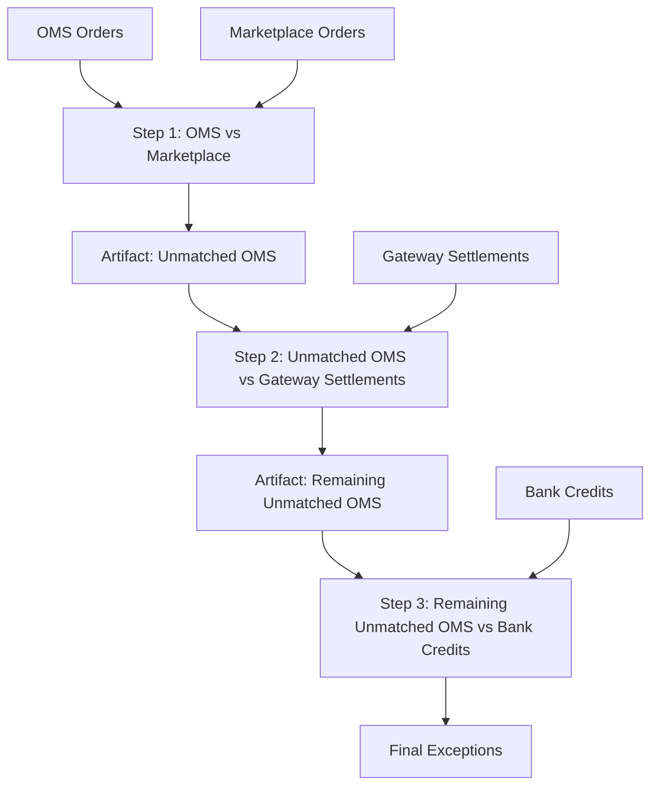

# E-commerce Settlement Template v1 Specification

**Status:** Proposed for P0.3  
**Owner:** Product + Architecture  
**Related Linear Issue:** `SMA-181`

## 1. Objective

Define the canonical e-commerce reconciliation template for v1 so teams can:

1. Instantiate a production-ready multi-step stream quickly
2. Validate behavior on a deterministic acceptance dataset
3. Use common exception policy and pilot checklist

## 2. Template Scope

This template targets payout reconciliation for marketplace commerce operations.

### In Scope

1. Order lifecycle and settlement reconciliation
2. Marketplace reported orders vs internal OMS orders
3. Payment gateway settlement matching
4. Bank credit confirmation

### Out of Scope

1. Refund chargeback recovery workflows (v2)
2. Tax/jurisdiction compliance allocation (v2)
3. Inventory planning optimization (separate template)

## 3. Canonical Stream Definition

Template name: `ECOMMERCE_SETTLEMENT_V1`

## 4. Step-by-Step Contract

## 4.1 Step 1: OMS vs Marketplace

1. Source input: `FILE` (OMS exports)
2. Target input: `FILE` (marketplace order report)
3. Primary purpose: identify orders not acknowledged by marketplace and value mismatches
4. Output artifact: `UNMATCHED_SOURCE` for downstream step

### Default keys

1. `order_id`
2. `order_line_id`

### Default mapped fields

1. `gross_amount`
2. `currency`
3. `order_status`
4. `order_date`

## 4.2 Step 2: Unmatched OMS vs Gateway Settlements

1. Source input: `STEP_OUTPUT_UNMATCHED_SOURCE` (from step 1)
2. Target input: `FILE` (gateway capture/settlement report)
3. Primary purpose: detect payment capture issues for orders missing in marketplace alignment
4. Output artifact: `UNMATCHED_SOURCE` for downstream step

### Default keys

1. `payment_reference`
2. `order_id`

### Default mapped fields

1. `captured_amount`
2. `capture_status`
3. `settlement_date`

## 4.3 Step 3: Remaining Unmatched OMS vs Bank Credits

1. Source input: `STEP_OUTPUT_UNMATCHED_SOURCE` (from step 2)
2. Target input: `FILE` (bank statement/credit file)
3. Primary purpose: confirm financial settlement and isolate true payout exceptions
4. Output artifact: final unmatched set + audit artifacts

### Default keys

1. `bank_reference`
2. `payment_reference`

### Default mapped fields

1. `credited_amount`
2. `credit_date`
3. `credit_status`

## 5. Matching Rule Defaults

| Field Type | Rule | Default |
|---|---|---|
| IDs (`order_id`, references) | `EXACT` | Case-sensitive exact match |
| Monetary fields | `RANGE` | Tolerance `0.01` absolute |
| Status fields | `EXACT` | Normalized uppercase comparison |
| Date fields | `RANGE` | +/- 1 day tolerance |
| Descriptive text | `CONTAINS` | Bidirectional contains |

## 6. Exception Severity Defaults

| Exception Type | Severity | Notes |
|---|---|---|
| Missing target at step 3 (bank not credited) | `CRITICAL` | Financial exposure |
| Missing target at step 2 (not in gateway) | `HIGH` | Payment risk |
| Missing target at step 1 (not in marketplace) | `HIGH` | Operational discrepancy |
| Value mismatch on key financial fields | `HIGH` | Amount/date variance |
| Non-key descriptive mismatch | `MEDIUM` | Investigate if persistent |
| Duplicate records | `MEDIUM` | Reconcile de-dup policy |

## 7. Acceptance Dataset Specification

## 7.1 Required files

1. `oms_orders.csv`
2. `marketplace_orders.csv`
3. `gateway_settlements.csv`
4. `bank_credits.csv`

## 7.2 Minimum dataset profile

1. Total OMS records: `>= 10,000`
2. Multi-currency rows present (`>= 2` currencies)
3. At least one full happy path order present across all four sources
4. At least one example for each targeted exception category

## 7.3 Required edge-case slices

1. Missing in marketplace only
2. Missing in gateway after marketplace miss
3. Missing in bank after gateway miss
4. Amount mismatch within tolerance (should match)
5. Amount mismatch beyond tolerance (should fail)
6. Duplicate keys in source and target
7. Null key field rows
8. Date offset exactly 1 day and more than 1 day

## 8. Expected Output Criteria

A run is accepted only if all checks pass:

1. Step completion:
   - Steps 1-3 reach terminal state (`COMPLETED` or policy-allowed `PARTIAL_FAILED`)
2. Artifact checks:
   - Unmatched artifacts generated for steps 1 and 2
   - Checksums present for all generated artifacts
3. Lineage checks:
   - Step 1 unmatched artifact is consumed by step 2
   - Step 2 unmatched artifact is consumed by step 3
4. Exception checks:
   - All injected edge cases appear in expected exception buckets
5. Compatibility checks:
   - No impact on legacy single reconciliation execution path

## 9. Pilot Validation Checklist

Before pilot sign-off:

1. [ ] Template instantiation works without manual step rewiring
2. [ ] Default mappings/rules execute without runtime schema errors
3. [ ] Finance operations can download and inspect all intermediate artifacts
4. [ ] Exception triage output is understandable without engineering assistance
5. [ ] Runbook and onboarding notes are available to pilot operators
6. [ ] Known limitations are documented with owner and ETA

## 10. Handoff to P4

This template spec is the baseline input for:

1. `SMA-194` package e-commerce template defaults
2. `SMA-195` clone/customize workflow
3. `SMA-196` onboarding and pilot validation kit

## 11. References

1. `docs/07-strategy/2026-02-21-reconciliation-platform-pivot-plan.md`
2. `docs/02-architecture/reconciliation-stream-runtime-architecture.md`
3. `docs/03-development/reconciliation-streams-api-contract.md`
4. Linear issue: `SMA-181`

