# Architecture Documentation

Smart Reconciliation System Architecture

## Table of Contents

1. [System Overview](#system-overview)
2. [Architecture Diagrams](#architecture-diagrams)
3. [Component Details](#component-details)
4. [Data Flow](#data-flow)
5. [Technology Stack](#technology-stack)
6. [Integration Points](#integration-points)
7. [Scalability Considerations](#scalability-considerations)

---

## System Overview

Smart Reconciliation is a Spring Boot application that leverages AI capabilities to automate and intelligently manage data reconciliation across multiple sources. The system follows a layered architecture pattern with clear separation of concerns.

### Key Architectural Principles

- **Modularity**: Each component has a single, well-defined responsibility
- **Loose Coupling**: Components interact through well-defined interfaces
- **AI-First Design**: AI capabilities integrated throughout the reconciliation process
- **Scalability**: Designed to handle large datasets and concurrent reconciliations
- **Extensibility**: Easy to add new data sources, file formats, and matching algorithms

---

## Architecture Diagrams

### C4 Model - Context Diagram

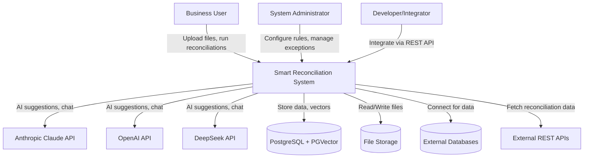

### C4 Model - Container Diagram

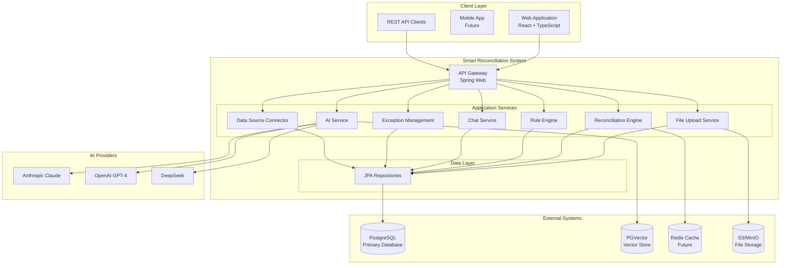

### Component Diagram - Reconciliation Engine

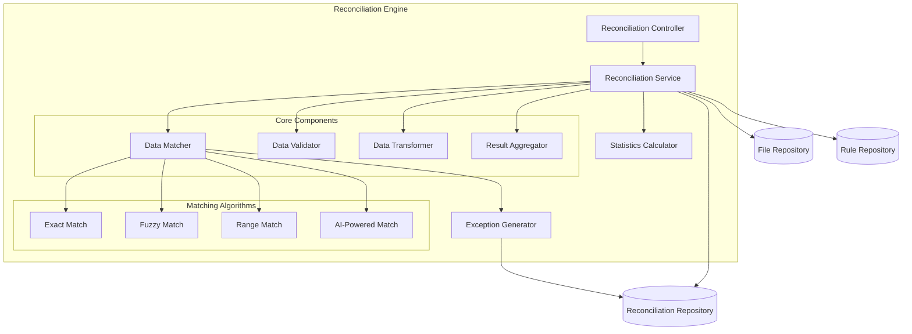

### Component Diagram - AI Integration

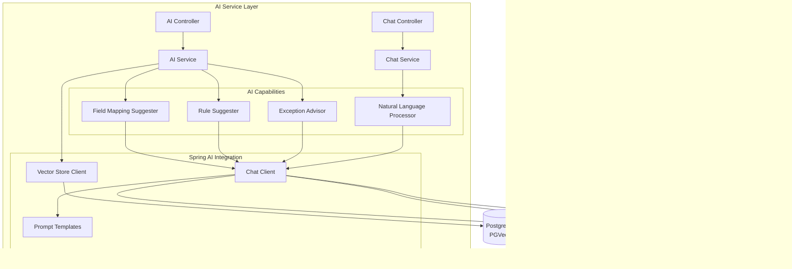

---

## Component Details

### 1. API Layer

#### Controllers

**Purpose:** Handle HTTP requests and responses, input validation, error handling.

**Key Controllers:**
- `ReconciliationController` - Manages reconciliation lifecycle
- `FileController` - File upload and management
- `RuleController` - Rule set CRUD operations
- `ExceptionController` - Exception management with filtering
- `ChatController` - Chat interface and streaming
- `AiController` - AI-powered suggestions
- `DataSourceController` - External data source management
- `DashboardController` - Metrics and statistics
- `HealthController` - Health checks

**Responsibilities:**
- Request validation using `@Valid` annotations
- Response wrapping in standard `ApiResponse` envelope
- Exception handling and error responses
- HTTP status code management

### 2. Service Layer

#### Core Services

**FileUploadService**
- Handles multipart file uploads
- Validates file types (CSV, Excel, JSON, XML)
- Coordinates schema detection
- Manages file metadata

**FileParserService**
- Parses different file formats
- Extracts data into standardized format
- Handles encoding detection
- Manages large file processing

**SchemaDetectionService**
- Auto-detects column types
- Infers data formats (dates, currencies, numbers)
- Identifies primary keys and unique fields
- Generates sample data for each column

**ReconciliationService**
- Orchestrates the reconciliation process
- Manages reconciliation lifecycle (PENDING → RUNNING → COMPLETED/FAILED)
- Coordinates matching algorithms
- Calculates statistics and match rates
- Generates reconciliation results

**RuleService**
- Manages rule sets and configurations
- Handles field mappings
- Maintains matching rules
- Validates rule consistency

**AiService**
- Provides AI-powered field mapping suggestions
- Generates matching rule recommendations
- Offers exception resolution suggestions
- Integrates with multiple AI providers

**ChatService**
- Manages chat sessions
- Handles message history
- Provides streaming responses
- Contextual AI conversations

**ExceptionService**
- Creates and manages reconciliation exceptions
- Categorizes exceptions by type and severity
- Provides filtering and pagination
- Bulk exception operations

**DataSourceService**
- Manages external data source connections
- Tests connectivity
- Handles authentication
- Coordinates data extraction

### 3. Data Layer

#### Entity Model

**Core Entities:**

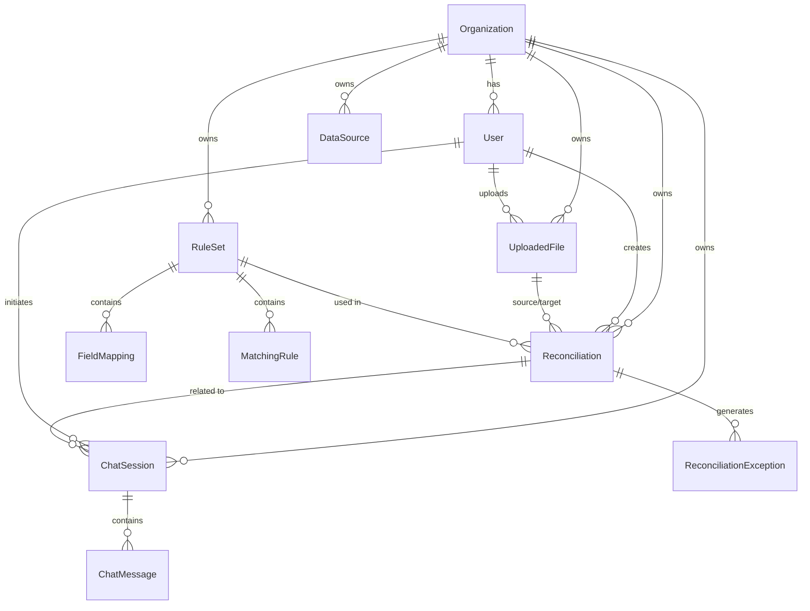

**Entity Descriptions:**

- **Organization** - Multi-tenant support, isolates data by organization
- **User** - System users with role-based access
- **DataSource** - External data source configurations
- **UploadedFile** - File metadata and parsing results
- **RuleSet** - Collection of field mappings and matching rules
- **FieldMapping** - Maps source fields to target fields with transformations
- **MatchingRule** - Defines matching logic (exact, fuzzy, range, etc.)
- **Reconciliation** - Reconciliation job with status and results
- **ReconciliationException** - Unmatched or problematic records
- **ChatSession** - Chat conversation container
- **ChatMessage** - Individual chat messages (user and assistant)

#### Repository Pattern

All data access uses Spring Data JPA repositories:

```java
public interface ReconciliationRepository extends JpaRepository<Reconciliation, Long> {
    List<Reconciliation> findByOrganizationId(Long organizationId);
    List<Reconciliation> findByStatus(ReconciliationStatus status);
}
```

### 4. AI Integration Layer

#### Spring AI Architecture

The system uses Spring AI 1.1.2 for AI integration, providing:

**Chat Clients:**
- `AnthropicChatClient` - Primary AI provider (Claude Sonnet 4)
- `OpenAiChatClient` - Secondary provider (GPT-4o)
- `DeepSeekChatClient` - Cost-effective alternative

**Vector Store:**
- `PGVectorStore` - PostgreSQL with PGVector extension for semantic search

**Prompt Engineering:**
- Template-based prompts for consistency
- Context injection from reconciliation data
- Few-shot learning examples

**AI Provider Selection:**

Configured via `application.properties`:
```properties
app.ai.provider=anthropic  # or openai, deepseek
```

Runtime provider switching based on:
- Configuration preference
- Availability
- Cost optimization
- Response time requirements

---

## Data Flow

### File Upload and Reconciliation Flow

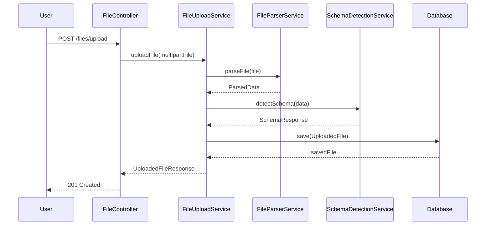

### Reconciliation Execution Flow

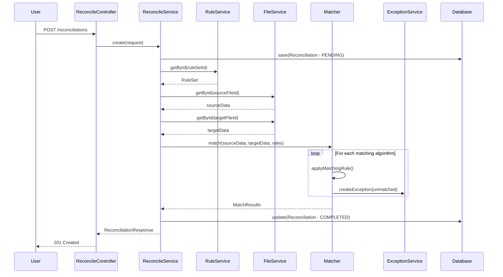

### AI-Powered Field Mapping Flow

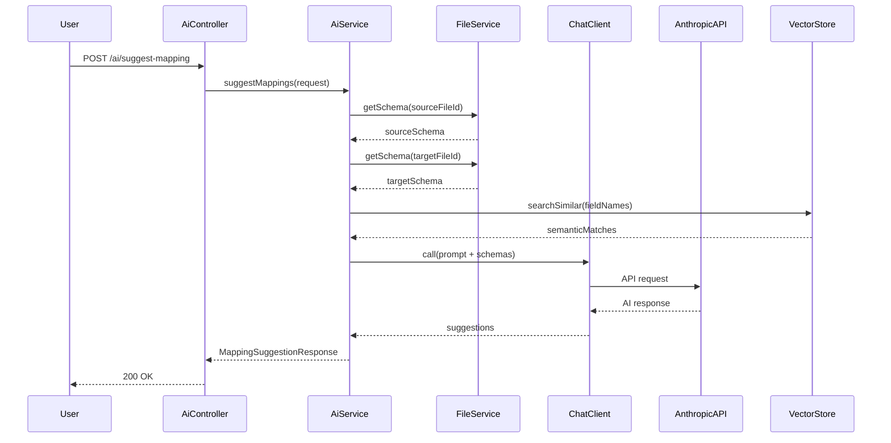

### Chat Streaming Flow

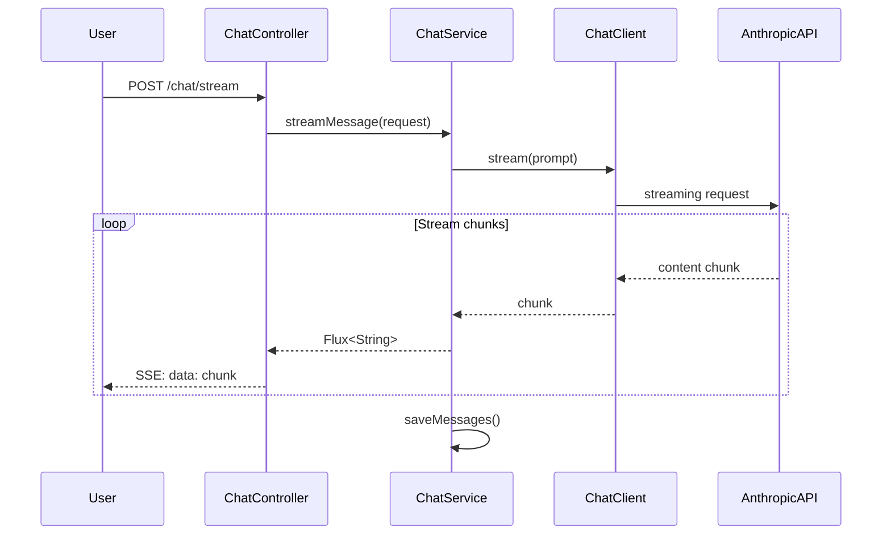

---

## Technology Stack

### Backend Framework

- **Spring Boot 3.5.10**
  - Spring Web (REST API)
  - Spring Data JPA (Data access)
  - Spring Validation (Input validation)
  - Spring WebFlux (Reactive streaming)
  - Spring Boot DevTools (Development)

### Database

- **PostgreSQL 16**
  - Primary relational database
  - JSONB support for flexible data storage
  - Full-text search capabilities

- **PGVector Extension**
  - Vector storage for semantic search
  - AI embedding storage
  - Similarity search

### AI Integration

- **Spring AI 1.1.2**
  - Unified AI abstraction layer
  - Multiple provider support
  - Vector store integration
  - Prompt templating

- **AI Providers**
  - Anthropic Claude (Sonnet 4) - Primary
  - OpenAI GPT-4o - Secondary
  - DeepSeek - Cost-effective alternative

### File Processing

- **Apache Commons CSV 1.10.0** - CSV parsing
- **Apache POI 5.2.5** - Excel file processing (.xlsx, .xls)
- **Jackson** - JSON processing

### Build Tools

- **Maven 3.x** - Dependency management and build
- **Maven Wrapper** - Consistent Maven version

### Runtime

- **Java 21** - LTS version with modern features
- **Docker Compose** - Local development environment
- **PostgreSQL Docker Image** - pgvector/pgvector:pg16

### Development Tools

- **Lombok** - Reduces boilerplate code
- **Spring Boot DevTools** - Hot reload
- **Spring Dotenv** - Environment variable management

---

## Integration Points

### AI Service Integration

**Anthropic Claude API**
```
Endpoint: https://api.anthropic.com/v1/messages
Model: claude-sonnet-4-20250514
Max Tokens: 4096
```

**OpenAI API**
```
Endpoint: https://api.openai.com/v1/chat/completions
Model: gpt-4o
Max Tokens: 4096
```

**DeepSeek API**
```
Endpoint: https://api.deepseek.com/v1/chat/completions
Model: deepseek-chat
Max Tokens: 4096
```

### Database Integration

**PostgreSQL Connection**
```
JDBC URL: jdbc:postgresql://localhost:5432/mydatabase
Driver: org.postgresql.Driver
Pool: HikariCP (default)
```

**PGVector Extension**
```
Extension: vector
Vector Dimensions: Configurable (default 1536 for OpenAI embeddings)
Distance Metric: Cosine similarity
```

### File Storage

**Current Implementation:**
- Local filesystem: `./uploads`
- File organization: `{uploadDir}/{organizationId}/{fileId}/`

**Production Recommendations:**
- Amazon S3 or S3-compatible storage (MinIO)
- Azure Blob Storage
- Google Cloud Storage

### External Data Sources

**Supported Types:**
- PostgreSQL, MySQL, SQL Server, Oracle databases
- REST APIs with OAuth/API key authentication
- File-based sources (CSV, Excel, JSON, XML)
- Future: Webhooks, message queues

---

## Scalability Considerations

### Current Architecture (Single Instance)

**Suitable for:**
- Up to 1000 reconciliations/day
- File sizes up to 100MB
- Concurrent users: 10-50

### Horizontal Scaling Strategy

**Load Balancing:**
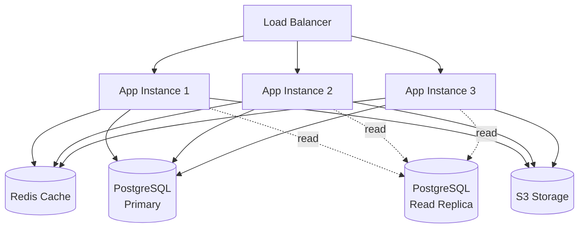

### Performance Optimizations

**Database:**
- Connection pooling (HikariCP)
- Indexed queries on frequently accessed columns
- Partitioning for large tables
- Read replicas for reporting

**Caching:**
- Redis for session data
- Application-level caching for file schemas
- CDN for static assets

**Async Processing:**
- Thread pool for reconciliation execution
- Message queue for long-running tasks (RabbitMQ/Kafka)
- Async exception generation

**File Processing:**
- Streaming for large files
- Chunked processing
- Parallel processing for multiple files

---

## Security Architecture

### Current State (Development)

- No authentication implemented
- CORS enabled for localhost development
- Database credentials in configuration files
- API keys in `.env` file

### Production Security Requirements

**Authentication & Authorization:**
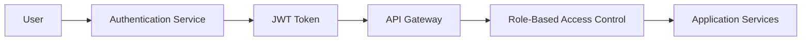

**Security Layers:**

1. **API Gateway**
   - JWT token validation
   - Rate limiting
   - IP whitelisting
   - Request/response logging

2. **Application Security**
   - Role-based access control (RBAC)
   - Organization-level data isolation
   - Input validation and sanitization
   - SQL injection prevention (JPA/Hibernate)

3. **Data Security**
   - Encryption at rest (database level)
   - Encryption in transit (TLS 1.3)
   - Sensitive data masking in logs
   - Secure API key storage (vault)

4. **AI Security**
   - API key rotation
   - Request/response audit logging
   - PII detection and redaction
   - Rate limiting per provider

---

## Deployment Architecture

### Development Environment

```
Local Machine
├── Spring Boot App (port 8080)
├── PostgreSQL Docker (port 5432)
└── File Storage (./uploads)
```

### Production Environment (Recommended)

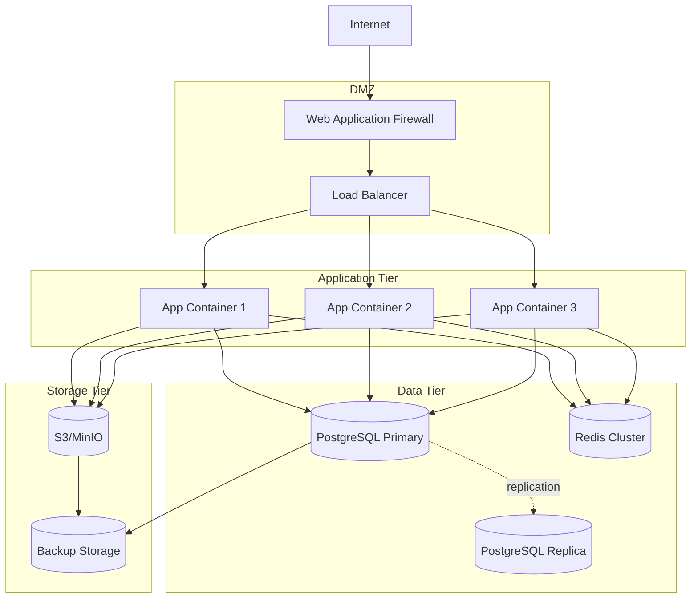

### Docker Deployment

**Multi-container deployment:**

```yaml
version: '3.8'
services:
  app:
    image: smartreconciliation:latest
    replicas: 3
    environment:
      - SPRING_PROFILES_ACTIVE=production
    depends_on:
      - postgres
      - redis

  postgres:
    image: pgvector/pgvector:pg16
    volumes:
      - postgres_data:/var/lib/postgresql/data

  redis:
    image: redis:7-alpine

  nginx:
    image: nginx:alpine
    ports:
      - "80:80"
      - "443:443"
```

---

## Monitoring and Observability

### Metrics to Monitor

**Application Metrics:**
- Request rate, latency, error rate
- Active reconciliations
- File upload success/failure rate
- AI API response times
- Exception rate

**Infrastructure Metrics:**
- CPU, memory, disk usage
- Database connection pool
- Thread pool utilization
- Network I/O

**Business Metrics:**
- Reconciliations per day
- Average match rate
- Exception resolution time
- User activity

### Logging Strategy

**Log Levels:**
- `ERROR` - System errors, exceptions
- `WARN` - Recoverable errors, deprecations
- `INFO` - Business events (reconciliation started, file uploaded)
- `DEBUG` - Detailed debugging information (development only)

**Log Aggregation:**
- ELK Stack (Elasticsearch, Logstash, Kibana)
- Splunk
- CloudWatch Logs (AWS)

### Health Checks

**Liveness Probe:**
```http
GET /actuator/health/liveness
```

**Readiness Probe:**
```http
GET /actuator/health/readiness
```

---

## Future Architecture Enhancements

### Microservices Migration

Potential split into:
- **File Service** - File upload and parsing
- **Reconciliation Service** - Core matching engine
- **AI Service** - AI capabilities
- **Rule Service** - Rule management
- **Notification Service** - Email, webhooks

### Event-Driven Architecture

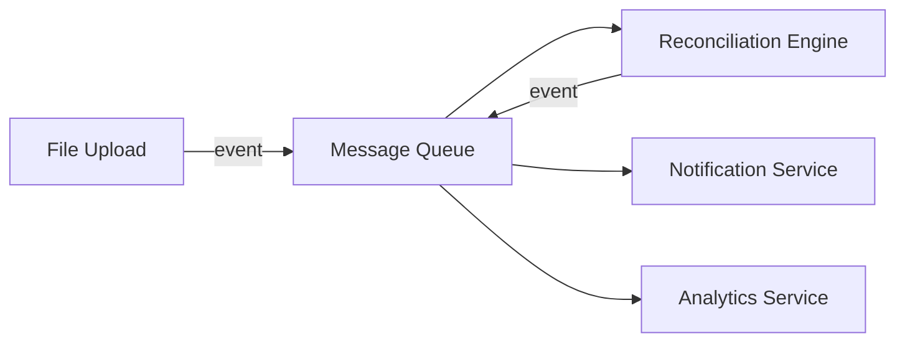

### AI Enhancements

- Local LLM support (Ollama, LM Studio)
- Fine-tuned models for domain-specific matching
- Reinforcement learning from user feedback
- Multi-modal AI (OCR for scanned documents)

---

## Conclusion

The Smart Reconciliation architecture is designed to be:
- **Scalable** - Can handle increasing load through horizontal scaling
- **Maintainable** - Clear separation of concerns, modular design
- **Extensible** - Easy to add new features, data sources, AI providers
- **Resilient** - Graceful degradation, error handling
- **Observable** - Comprehensive monitoring and logging

For implementation details, see:
- [API Reference](api-reference.md)
- [Developer Guide](developer-guide.md)
- [Deployment Guide](deployment-guide.md)
- [Database Documentation](database-schema.md)
