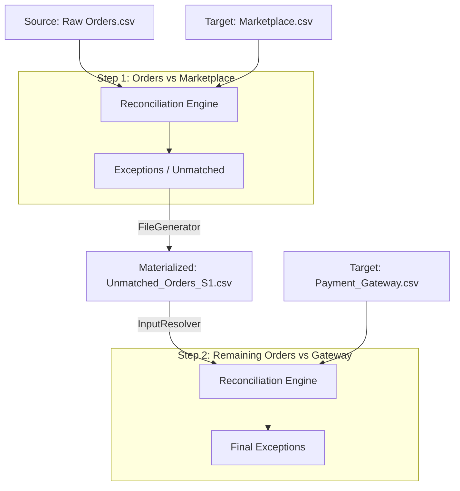
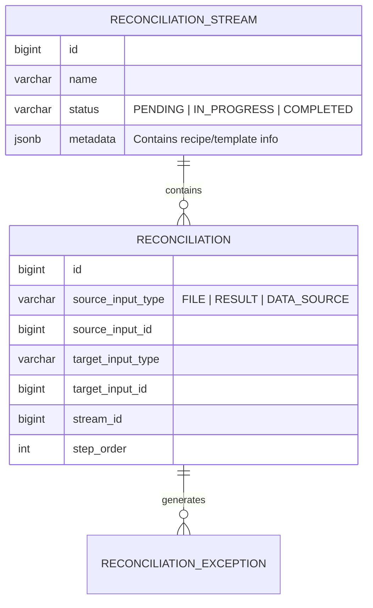

# Architecture: Reconciliation Pipelines

This document details the technical implementation of the Reconciliation Pipeline (N-Way Chaining) system.

## 1. Pipeline Data Flow

The following diagram illustrates how data flows from raw uploads through multiple reconciliation stages using **Materialized Intermediate Artifacts**.



## 2. Updated Entity Relationship

To support this, we move from a file-centric model to a source-agnostic model.



## 3. The Input Resolver Pattern

The `InputResolverService` abstracts the source of data. This allows the core engine to remain identical regardless of whether it's reading a real file or a result from 5 minutes ago.

```java
public interface InputProvider {
    Stream<Map<String, Object>> streamData();
    SchemaResponse getSchema();
}

@Service
public class InputResolverService {
    public InputProvider getProvider(DataSourceType type, Long id) {
        return switch (type) {
            case FILE -> new FileInputProvider(id);
            case RECONCILIATION_RESULT -> new ResultInputProvider(id);
            case DATA_SOURCE -> new ExternalSourceProvider(id);
        };
    }
}
```

## 4. Key Advantages

1.  **Traceability (Audit Ready):** Every step produces a downloadable file of "What was left." Auditors can verify exactly how the system arrived at the final exceptions.
2.  **Stateless Engine:** The `ReconciliationService` doesn't need to know about the "Stream". It just processes two inputs. This minimizes refactoring risk.
3.  **Scalability:** By materializing files to disk, we avoid keeping massive JSON results in the database or memory between steps.
4.  **Specialized Recipes:** We can create "Templates" (e.g., "Standard E-commerce Recipe") that are just JSON definitions of 3 chained reconciliation steps.
