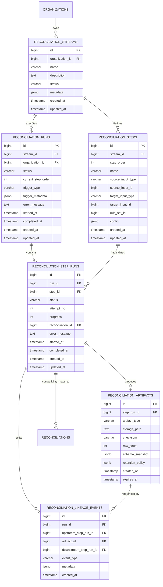
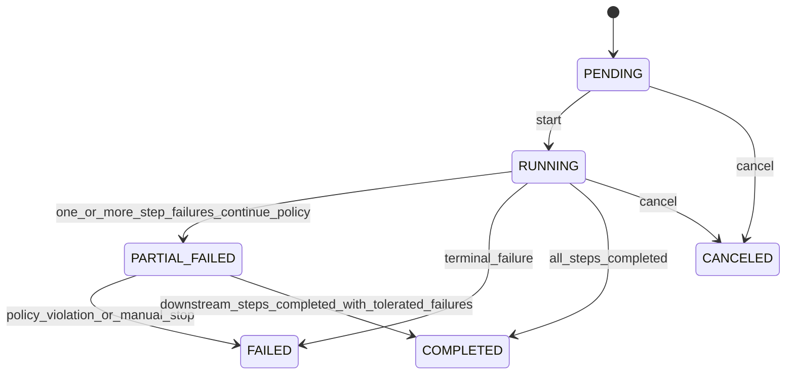
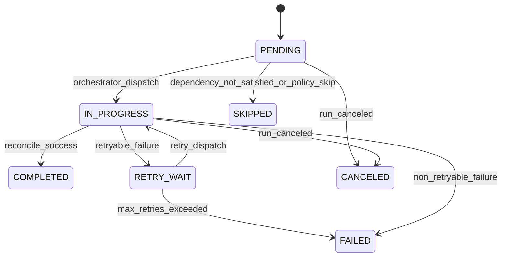

# Reconciliation Stream Runtime Architecture

This document finalizes the architecture contract for the pivot from point-to-point reconciliation to stream-based multi-step reconciliation execution.

## 1. Objective

Define the implementation-ready architecture for:

1. Stream/run/step runtime model
2. Artifact materialization and lineage
3. Runtime state model and transitions
4. Service ownership boundaries for backend implementation

This is the architecture baseline for P1 and P2 delivery.

## 2. Scope and Non-Goals

### In Scope

1. Runtime entities for stream orchestration
2. Input resolution contract for file/result/data source inputs
3. Artifact and lineage persistence boundaries
4. Compatibility model for existing reconciliation APIs

### Non-Goals (for this phase)

1. Full real-time streaming architecture
2. Regulated-grade maker/checker controls
3. Industry-specific template details (covered in P0.3/P4)

## 3. Core Domain Model

The runtime model separates definition-time objects from execution-time objects:

1. Definition-time:
   - `reconciliation_streams`
   - `reconciliation_steps`
2. Execution-time:
   - `reconciliation_runs`
   - `reconciliation_step_runs`
   - `reconciliation_artifacts`
   - `reconciliation_lineage_events`

### 3.1 Entity Relationship Diagram

### 3.2 Input Type Contract

Supported input types:

1. `FILE`
2. `STEP_OUTPUT_UNMATCHED_SOURCE`
3. `STEP_OUTPUT_UNMATCHED_TARGET`
4. `DATA_SOURCE_SNAPSHOT`

Each input type resolves to the same logical contract:

- data stream (rows)
- schema metadata
- source identity metadata (for lineage/audit)

## 4. Runtime State Model

### 4.1 Stream Run State Machine

### 4.2 Step Run State Machine

### 4.3 Retry and Idempotency Rules

1. Each step run must carry a deterministic idempotency key (`run_id + step_id + attempt_no` boundary).
2. Retry is allowed only for retryable errors, bounded by max attempts in step config.
3. A completed step run is immutable and cannot be re-executed in-place.
4. Re-run behavior is modeled as a new `reconciliation_run`.

## 5. Service Boundaries and Ownership

| Layer | Component | Ownership | Responsibilities |
|---|---|---|---|
| API | `StreamController` | Backend API | Stream/run CRUD, validation endpoints, orchestration triggers |
| Orchestration | `StreamOrchestratorService` | Backend Core | Run lifecycle, step scheduling, retry policy, cancellation |
| Input | `InputResolverService` + `InputProvider` strategy | Backend Core | Resolve polymorphic input sources to unified parsing contract |
| Matching | `ReconciliationService` (existing core) | Backend Core | Execute two-input matching logic, emit exceptions/statistics |
| Artifact | `ArtifactService` | Backend Core | Persist unmatched outputs, checksums, metadata, download references |
| Lineage | `LineageService` | Backend Core | Emit immutable lineage events, support audit queries |
| Compatibility | `LegacyReconciliationAdapterService` | Backend API | Map existing `/api/v1/reconciliations` to one-step stream runs |
| Persistence | Repositories | Backend Data | Entity persistence and org-scoped retrieval |

## 6. Compatibility Contract

1. Existing `POST /api/v1/reconciliations` remains available.
2. Legacy single reconciliation execution maps internally to a single-step stream run.
3. Existing response DTOs remain backward compatible for current frontend clients.
4. New stream APIs are additive; no breaking removal in this phase.

## 7. Implementation Constraints for P1/P2

### P1 Constraints

1. Introduce new entities/migrations without removing legacy columns.
2. Keep legacy service behavior stable behind adapter.
3. Keep org-level authorization parity with existing reconciliation/file entities.

### P2 Constraints

1. Artifact generation must be deterministic and auditable.
2. Lineage events must be append-only and immutable.
3. Input resolution failures must be explicit and actionable (include source identifiers).
4. Chaining behavior must not require manual intermediate file upload.

## 8. Handoff Checklist

Before `SMA-178` is considered complete:

1. ERD is published and aligned with runtime entities.
2. State transition model is explicit for run and step run.
3. Service ownership and boundaries are documented.
4. P1 implementers can start without architecture ambiguity.

## 9. Migration Sequence and Rollback Strategy

### 9.1 Forward migration sequence

1. Add new runtime tables:
   - `reconciliation_streams`
   - `reconciliation_steps`
   - `reconciliation_runs`
   - `reconciliation_step_runs`
   - `reconciliation_artifacts`
   - `reconciliation_lineage_events`
2. Add compatibility link columns (nullable only) to legacy entities as needed.
3. Deploy services with dual-path support:
   - new stream APIs enabled
   - legacy reconciliation APIs mapped via compatibility adapter
4. Enable stream UI/API consumers behind feature flag.
5. Validate parity between legacy flow and one-step stream mapping in lower environments.

### 9.2 Rollback strategy

1. Do not drop or rename legacy columns/tables in P1/P2.
2. Runtime rollback path:
   - disable stream entrypoints using feature flag
   - route all calls to legacy reconciliation path
3. Data rollback posture:
   - keep new tables additive and isolated
   - no destructive backfill into legacy entities
4. Migration rollback posture:
   - reverse only additive schema migrations if required by release policy
   - preserve legacy runtime integrity regardless of stream-table rollback

## 10. P1 Kickoff Checklist

1. [ ] ERD and state model approved (`SMA-178`)
2. [ ] API contract and compatibility matrix approved (`SMA-179`)
3. [ ] E-commerce template acceptance dataset approved (`SMA-181`)
4. [ ] Migration sequence and rollback path reviewed
5. [ ] P1 implementation owners confirmed for backend runtime work

## 11. References

1. `docs/07-strategy/2026-02-21-reconciliation-platform-pivot-plan.md`
2. `docs/02-architecture/reconciliation-pipelines.md`
3. `docs/plans/2026-02-21-reconciliation-pipelines.md`
4. Linear issue: `SMA-178`
