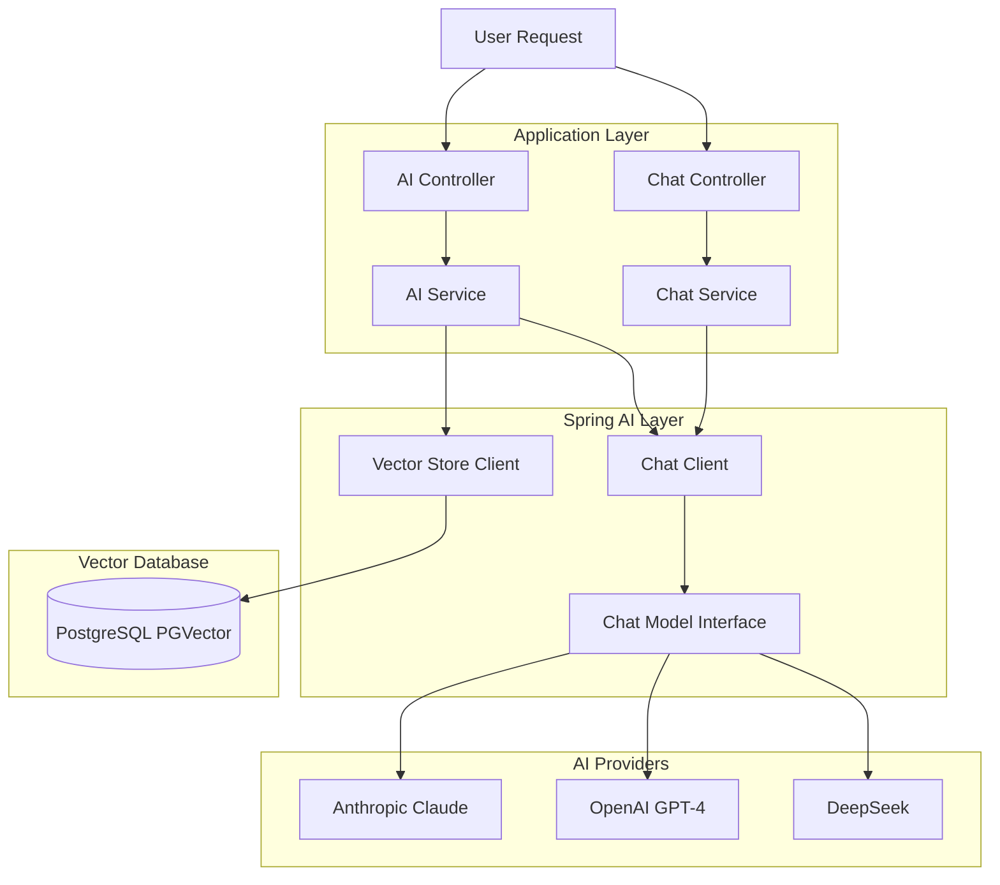

# AI Integration Guide

Complete guide to AI capabilities in Smart Reconciliation

## Table of Contents

1. [Overview](#overview)
2. [Spring AI Framework](#spring-ai-framework)
3. [AI Providers](#ai-providers)
4. [AI Features](#ai-features)
5. [Implementation Guide](#implementation-guide)
6. [Prompt Engineering](#prompt-engineering)
7. [Vector Store Integration](#vector-store-integration)
8. [Best Practices](#best-practices)
9. [Troubleshooting](#troubleshooting)
10. [Advanced Topics](#advanced-topics)

---

## Overview

Smart Reconciliation leverages AI capabilities to automate and enhance the reconciliation process. AI is used for:

- **Field Mapping Suggestions** - Automatically suggest how fields should be mapped between files
- **Rule Generation** - AI-generated matching rules based on data patterns
- **Exception Resolution** - Intelligent suggestions for resolving discrepancies
- **Natural Language Chat** - Conversational interface for understanding reconciliation results
- **Semantic Search** - Vector-based search for similar reconciliation patterns (future)

### AI Architecture



---

## Spring AI Framework

### What is Spring AI?

Spring AI is a framework that provides:
- **Unified API** - Single interface for multiple AI providers
- **Model Abstraction** - Switch providers without code changes
- **Streaming Support** - Server-Sent Events for real-time responses
- **Vector Store Integration** - Built-in support for vector databases
- **Function Calling** - AI can trigger application functions
- **Observability** - Metrics and tracing for AI operations

### Version

Smart Reconciliation uses **Spring AI 1.1.2** (Spring Boot 3.5.10 compatible)

### Core Dependencies

```xml
<dependencies>
    <!-- Spring AI BOM -->
    <dependency>
        <groupId>org.springframework.ai</groupId>
        <artifactId>spring-ai-bom</artifactId>
        <version>1.1.2</version>
        <type>pom</type>
        <scope>import</scope>
    </dependency>

    <!-- AI Provider Starters -->
    <dependency>
        <groupId>org.springframework.ai</groupId>
        <artifactId>spring-ai-starter-model-anthropic</artifactId>
    </dependency>

    <dependency>
        <groupId>org.springframework.ai</groupId>
        <artifactId>spring-ai-starter-model-openai</artifactId>
    </dependency>

    <dependency>
        <groupId>org.springframework.ai</groupId>
        <artifactId>spring-ai-starter-model-deepseek</artifactId>
    </dependency>

    <!-- Vector Store -->
    <dependency>
        <groupId>org.springframework.ai</groupId>
        <artifactId>spring-ai-starter-vector-store-pgvector</artifactId>
    </dependency>

    <!-- Advisors (for RAG patterns) -->
    <dependency>
        <groupId>org.springframework.ai</groupId>
        <artifactId>spring-ai-advisors-vector-store</artifactId>
    </dependency>
</dependencies>
```

---

## AI Providers

### Provider Comparison

| Feature | Anthropic Claude | OpenAI GPT-4 | DeepSeek |
|---------|------------------|--------------|----------|
| **Best For** | Complex reasoning, long context | General purpose, function calling | Cost-effective, code understanding |
| **Context Window** | 200K tokens | 128K tokens | 32K tokens |
| **Cost (per 1M tokens)** | $3 (input) / $15 (output) | $2.50 (input) / $10 (output) | $0.14 (input) / $0.28 (output) |
| **Response Speed** | Fast | Very fast | Ultra fast |
| **Structured Output** | JSON mode | JSON mode | JSON mode |
| **Streaming** | Yes | Yes | Yes |

### Anthropic Claude (Primary)

**Model:** `claude-sonnet-4-20250514`

**Strengths:**
- Excellent at complex analytical tasks
- Strong structured output generation
- Best for field mapping and rule suggestion
- High accuracy in understanding data patterns

**Configuration:**

```properties
spring.ai.anthropic.api-key=${ANTHROPIC_API_KEY}
spring.ai.anthropic.chat.options.model=claude-sonnet-4-20250514
spring.ai.anthropic.chat.options.max-tokens=4096
spring.ai.anthropic.chat.options.temperature=0.7
```

**API Key:** Get from https://console.anthropic.com/

### OpenAI GPT-4 (Secondary)

**Model:** `gpt-4o`

**Strengths:**
- Fast response times
- Excellent general-purpose capabilities
- Strong function calling support
- Good for conversational interfaces

**Configuration:**

```properties
spring.ai.openai.api-key=${OPENAI_API_KEY}
spring.ai.openai.chat.options.model=gpt-4o
spring.ai.openai.chat.options.max-tokens=4096
spring.ai.openai.chat.options.temperature=0.7
```

**API Key:** Get from https://platform.openai.com/api-keys

### DeepSeek (Cost-Effective)

**Model:** `deepseek-chat`

**Strengths:**
- Very low cost (20x cheaper than GPT-4)
- Fast response times
- Good for high-volume operations
- Reasonable accuracy for most tasks

**Configuration:**

```properties
spring.ai.deepseek.api-key=${DEEPSEEK_API_KEY}
spring.ai.deepseek.chat.options.model=deepseek-chat
spring.ai.deepseek.chat.options.max-tokens=4096
```

**API Key:** Get from https://platform.deepseek.com/

### Selecting a Provider

Set the active provider:

```properties
app.ai.provider=anthropic  # or openai, deepseek
```

**Provider Selection Strategy:**

```java
@Service
public class AiService {

    @Value("${app.ai.provider:anthropic}")
    private String provider;

    private final ChatModel chatModel;  // Auto-injected based on configuration

    // Spring AI automatically injects the correct ChatModel
    // based on which starter is on the classpath
}
```

---

## AI Features

### 1. Field Mapping Suggestions

Automatically suggests how fields should be mapped between source and target files.

**Endpoint:** `POST /api/v1/ai/suggest-mapping`

**Request:**

```json
{
  "sourceFileId": 1,
  "targetFileId": 2,
  "sourceFields": ["txn_id", "amt", "customer"],
  "targetFields": ["transaction_id", "amount", "client_name"]
}
```

**Response:**

```json
{
  "success": true,
  "data": {
    "mappings": [
      {
        "sourceField": "txn_id",
        "targetField": "transaction_id",
        "confidence": 0.95,
        "reason": "Semantic similarity and common naming pattern",
        "isKey": true,
        "suggestedTransform": null
      },
      {
        "sourceField": "amt",
        "targetField": "amount",
        "confidence": 0.92,
        "reason": "Common abbreviation for amount",
        "isKey": false,
        "suggestedTransform": null
      }
    ],
    "explanation": "These mappings are based on semantic similarity and common data patterns."
  }
}
```

**How it Works:**

1. Retrieves schemas for both files
2. Analyzes column names, data types, and sample values
3. Uses AI to identify semantic relationships
4. Returns mappings with confidence scores

**Implementation:**

```java
public AiMappingSuggestionResponse suggestMappings(AiMappingSuggestionRequest request) {
    SchemaResponse sourceSchema = fileUploadService.getSchema(request.getSourceFileId());
    SchemaResponse targetSchema = fileUploadService.getSchema(request.getTargetFileId());

    String prompt = buildMappingSuggestionPrompt(sourceSchema, targetSchema);

    ChatClient chatClient = ChatClient.create(chatModel);
    String response = chatClient.prompt()
            .user(prompt)
            .call()
            .content();

    return parseMappingSuggestionResponse(response);
}
```

---

### 2. Matching Rule Suggestions

Generates intelligent matching rules based on file schemas.

**Endpoint:** `POST /api/v1/ai/suggest-rules`

**Request:**

```http
POST /api/v1/ai/suggest-rules?sourceFileId=1&targetFileId=2&mappedFields=transaction_id,amount
```

**Response:**

```json
{
  "success": true,
  "data": "Based on the file schemas, I recommend:\n\n1. Primary Key Match: Use 'transaction_id' for exact matching (weight: 1.0)\n2. Amount Match: Match 'amount' with tolerance of ±0.01 (weight: 0.8)\n3. Fuzzy Name Match: Apply fuzzy matching on 'customer_name' with 85% threshold (weight: 0.6)\n\nThis multi-tier approach maximizes match rate while maintaining accuracy."
}
```

**How it Works:**

1. Analyzes schemas and existing mappings
2. Identifies likely key fields
3. Suggests appropriate matching strategies
4. Recommends tolerances and thresholds

---

### 3. Exception Resolution Suggestions

Provides AI-powered suggestions for resolving reconciliation exceptions.

**Endpoint:** `GET /api/v1/exceptions/{id}/suggestions`

**Request:**

```http
GET /api/v1/exceptions/123/suggestions
```

**Response:**

```json
{
  "success": true,
  "data": "This $0.01 amount mismatch appears to be a rounding difference. The discrepancy is within acceptable tolerance for financial reconciliation. Suggested action: Mark as resolved with 'Rounding variance' as the reason."
}
```

**How it Works:**

```java
public String getExceptionSuggestion(String exceptionType, String sourceValue,
                                      String targetValue, String fieldName, String context) {
    String prompt = buildExceptionSuggestionPrompt(
        exceptionType, sourceValue, targetValue, fieldName, context
    );

    ChatClient chatClient = ChatClient.create(chatModel);
    return chatClient.prompt()
            .user(prompt)
            .call()
            .content();
}
```

---

### 4. Chat Interface

Conversational AI for understanding reconciliation results.

**Endpoint:** `POST /api/v1/chat/message`

**Request:**

```json
{
  "sessionId": 1,
  "message": "Why do I have 25 exceptions?"
}
```

**Response:**

```json
{
  "success": true,
  "data": {
    "sessionId": 1,
    "messageId": 42,
    "role": "assistant",
    "response": "I've analyzed your reconciliation. The 25 exceptions break down as follows:\n- 15 cases: Rounding differences in amounts (±$0.01)\n- 10 cases: Date format variations\n\nWould you like me to suggest automatic resolution rules?",
    "createdAt": "2026-01-31T10:35:05"
  }
}
```

**Streaming Version:**

**Endpoint:** `POST /api/v1/chat/stream`

**Response:** Server-Sent Events stream

```
data: I've

data:  analyzed

data:  your

data:  reconciliation...
```

**How it Works:**

```java
public Flux<String> streamMessage(ChatRequest request) {
    String context = buildContext(session);

    return aiService.chat(request.getMessage(), context)
            .doOnNext(fullResponse::append)
            .doOnComplete(() -> saveAssistantMessage(fullResponse.toString()));
}
```

**Context Building:**

The chat service builds rich context including:
- Reconciliation name and status
- Match rate and exception count
- File names
- Recent conversation history (last 10 messages)

---

## Implementation Guide

### Setting Up AI Service

**1. Create AI Service:**

```java
@Service
public class AiService {
    private final ChatModel chatModel;

    public AiService(ChatModel chatModel) {
        this.chatModel = chatModel;  // Auto-injected by Spring AI
    }

    public String askAI(String prompt) {
        ChatClient chatClient = ChatClient.create(chatModel);
        return chatClient.prompt()
                .user(prompt)
                .call()
                .content();
    }
}
```

**2. Using ChatClient API:**

**Simple Call:**

```java
ChatClient chatClient = ChatClient.create(chatModel);
String response = chatClient.prompt()
        .user("Your prompt here")
        .call()
        .content();
```

**With System Prompt:**

```java
String response = chatClient.prompt()
        .system("You are a data reconciliation expert")
        .user("Analyze this data...")
        .call()
        .content();
```

**Streaming Response:**

```java
Flux<String> stream = chatClient.prompt()
        .user("Your prompt here")
        .stream()
        .content();
```

**With Options:**

```java
String response = chatClient.prompt()
        .user("Your prompt here")
        .options(ChatOptionsBuilder.builder()
                .withModel("claude-opus-4")
                .withTemperature(0.5)
                .withMaxTokens(2000)
                .build())
        .call()
        .content();
```

### Prompt Templates

**Define Prompt Template:**

```java
@Bean
public PromptTemplate mappingSuggestionTemplate() {
    return new PromptTemplate("""
        Analyze these file schemas and suggest field mappings.

        Source: {sourceSchema}
        Target: {targetSchema}

        Return JSON with mappings array.
        """);
}
```

**Use Template:**

```java
Map<String, Object> model = Map.of(
    "sourceSchema", sourceSchemaJson,
    "targetSchema", targetSchemaJson
);

Prompt prompt = promptTemplate.create(model);
String response = chatClient.prompt(prompt).call().content();
```

### Error Handling

```java
public String askAI(String prompt) {
    try {
        ChatClient chatClient = ChatClient.create(chatModel);
        return chatClient.prompt()
                .user(prompt)
                .call()
                .content();
    } catch (Exception e) {
        log.error("AI service error: {}", e.getMessage(), e);
        throw new AiServiceException("Failed to get AI response", e);
    }
}
```

---

## Prompt Engineering

### Principles

1. **Be Specific** - Clearly state what you want
2. **Provide Context** - Include relevant data and schemas
3. **Use Examples** - Show desired output format
4. **Set Constraints** - Define limitations and requirements
5. **Request Structured Output** - Ask for JSON when parsing needed

### Field Mapping Prompt Example

```java
private String buildMappingSuggestionPrompt(SchemaResponse source, SchemaResponse target) {
    return """
        You are a data reconciliation expert. Analyze these two file schemas
        and suggest field mappings.

        SOURCE FILE: %s
        Columns:
        %s

        TARGET FILE: %s
        Columns:
        %s

        Provide field mappings as JSON array with format:
        {
          "mappings": [
            {
              "sourceField": "source_column_name",
              "targetField": "target_column_name",
              "confidence": 0.95,
              "reason": "Why these fields match",
              "isKey": true/false,
              "suggestedTransform": "optional transform"
            }
          ],
          "explanation": "Overall explanation"
        }

        Only return valid JSON, no markdown code blocks.
        """.formatted(
            source.getFilename(),
            formatColumns(source.getColumns()),
            target.getFilename(),
            formatColumns(target.getColumns())
        );
}
```

### Exception Suggestion Prompt

```java
private String buildExceptionSuggestionPrompt(String exceptionType,
                                               String sourceValue,
                                               String targetValue,
                                               String fieldName) {
    return """
        You are a data reconciliation expert. Analyze this exception and
        suggest a resolution.

        Exception Type: %s
        Field: %s
        Source Value: %s
        Target Value: %s

        Provide a brief, actionable suggestion for resolving this discrepancy.
        Consider: formatting differences, rounding, timing, data entry errors.
        """.formatted(exceptionType, fieldName, sourceValue, targetValue);
}
```

### Chat System Prompt

```java
private String buildChatSystemPrompt(String context) {
    return """
        You are an AI assistant specialized in data reconciliation. You help users:
        - Understand reconciliation results and exceptions
        - Suggest solutions for data mismatches
        - Explain matching rules and field mappings
        - Provide insights on data quality issues

        Be concise, helpful, and technical when needed.

        Current context:
        %s
        """.formatted(context != null ? context : "No specific context");
}
```

---

## Vector Store Integration

### PGVector Setup

**Enable Extension:**

```sql
CREATE EXTENSION IF NOT EXISTS vector;
```

**Configuration:**

```properties
spring.ai.vectorstore.pgvector.initialize-schema=true
spring.ai.vectorstore.pgvector.dimensions=1536
spring.ai.vectorstore.pgvector.distance-type=COSINE_DISTANCE
```

### Storing Embeddings (Future Feature)

```java
@Service
public class EmbeddingService {

    private final VectorStore vectorStore;
    private final EmbeddingModel embeddingModel;

    public void storeReconciliationPattern(Reconciliation reconciliation) {
        String content = buildContentFromReconciliation(reconciliation);

        List<Document> documents = List.of(
            new Document(content, Map.of(
                "reconciliationId", reconciliation.getId(),
                "type", "reconciliation_pattern"
            ))
        );

        vectorStore.add(documents);
    }

    public List<Document> findSimilarPatterns(String query, int topK) {
        return vectorStore.similaritySearch(
            SearchRequest.query(query).withTopK(topK)
        );
    }
}
```

### Semantic Search Example

```java
public List<SimilarReconciliation> findSimilarReconciliations(Long reconciliationId) {
    Reconciliation rec = reconciliationRepository.findById(reconciliationId)
        .orElseThrow();

    String query = buildQueryFromReconciliation(rec);

    List<Document> similar = vectorStore.similaritySearch(
        SearchRequest.query(query)
            .withTopK(5)
            .withSimilarityThreshold(0.7)
    );

    return similar.stream()
        .map(this::documentToReconciliation)
        .collect(Collectors.toList());
}
```

---

## Best Practices

### 1. Cost Management

**Track Token Usage:**

```java
@Aspect
@Component
public class AiMetricsAspect {

    private final MeterRegistry registry;

    @Around("@annotation(TrackAiUsage)")
    public Object trackUsage(ProceedingJoinPoint joinPoint) throws Throwable {
        Timer.Sample sample = Timer.start(registry);
        try {
            Object result = joinPoint.proceed();
            sample.stop(Timer.builder("ai.request.duration")
                .tag("provider", getCurrentProvider())
                .register(registry));
            return result;
        } catch (Exception e) {
            registry.counter("ai.request.errors").increment();
            throw e;
        }
    }
}
```

**Use Cheaper Models for Simple Tasks:**

```java
public String getSimpleResponse(String prompt) {
    // Use DeepSeek for simple classification
    if (isSimpleClassification(prompt)) {
        return deepSeekService.call(prompt);
    }
    // Use Claude for complex analysis
    return anthropicService.call(prompt);
}
```

### 2. Caching

**Cache Expensive AI Operations:**

```java
@Cacheable(value = "ai-mappings", key = "#sourceFileId + '-' + #targetFileId")
public AiMappingSuggestionResponse suggestMappings(Long sourceFileId, Long targetFileId) {
    // Expensive AI call
}
```

### 3. Retry Logic

```java
@Retryable(
    value = {AiServiceException.class},
    maxAttempts = 3,
    backoff = @Backoff(delay = 1000, multiplier = 2)
)
public String askAI(String prompt) {
    return chatClient.prompt().user(prompt).call().content();
}
```

### 4. Timeout Configuration

```java
@Bean
public ChatClient chatClient(ChatModel chatModel) {
    return ChatClient.builder(chatModel)
        .defaultOptions(ChatOptions.builder()
            .withTimeout(Duration.ofSeconds(30))
            .build())
        .build();
}
```

### 5. Response Validation

```java
private AiMappingSuggestionResponse parseResponse(String response) {
    // Remove markdown code blocks
    String cleaned = response.trim()
        .replaceAll("```json\\n?", "")
        .replaceAll("```\\n?", "")
        .trim();

    try {
        return objectMapper.readValue(cleaned, AiMappingSuggestionResponse.class);
    } catch (JsonProcessingException e) {
        log.error("Failed to parse AI response: {}", response);
        throw new AiServiceException("Invalid AI response format", e);
    }
}
```

---

## Troubleshooting

### API Key Issues

**Problem:** `401 Unauthorized` or `API key not found`

**Solution:**

1. Check .env file exists and is loaded
2. Verify API key is correct
3. Check environment variable is set:

```bash
echo $ANTHROPIC_API_KEY  # Unix
echo %ANTHROPIC_API_KEY%  # Windows
```

### Rate Limiting

**Problem:** `429 Too Many Requests`

**Solution:**

Implement exponential backoff:

```java
@Retryable(
    value = {RateLimitException.class},
    maxAttempts = 5,
    backoff = @Backoff(delay = 2000, multiplier = 2, maxDelay = 30000)
)
public String askAI(String prompt) {
    // AI call
}
```

### Timeout Errors

**Problem:** AI requests timing out

**Solution:**

Increase timeout:

```properties
spring.ai.anthropic.chat.options.timeout=60s
```

Or use async processing:

```java
@Async
public CompletableFuture<String> askAIAsync(String prompt) {
    return CompletableFuture.completedFuture(askAI(prompt));
}
```

### Malformed JSON Responses

**Problem:** AI returns invalid JSON

**Solution:**

Improve prompt to be more explicit:

```java
String prompt = """
    IMPORTANT: Return ONLY valid JSON, no explanations before or after.
    Do not use markdown code blocks.

    Format:
    {
      "field": "value"
    }
    """;
```

---

## Advanced Topics

### Function Calling (Future)

Allow AI to trigger application functions:

```java
@Bean
public FunctionCallback getReconciliationFunction() {
    return FunctionCallback.builder()
        .function("getReconciliation", (Long id) -> {
            return reconciliationService.getById(id);
        })
        .description("Get reconciliation by ID")
        .inputType(Long.class)
        .build();
}
```

### RAG (Retrieval-Augmented Generation)

Combine vector search with AI generation:

```java
public String answerWithContext(String question) {
    // Retrieve relevant documents
    List<Document> context = vectorStore.similaritySearch(
        SearchRequest.query(question).withTopK(3)
    );

    // Build prompt with context
    String prompt = buildPromptWithContext(question, context);

    // Generate answer
    return chatClient.prompt().user(prompt).call().content();
}
```

### Multi-Model Orchestration

Use different models for different tasks:

```java
public ReconciliationAnalysis analyzeReconciliation(Long id) {
    // Use Claude for complex analysis
    String analysis = claudeService.analyze(id);

    // Use GPT-4 for summarization
    String summary = gpt4Service.summarize(analysis);

    // Use DeepSeek for categorization
    String category = deepSeekService.categorize(summary);

    return new ReconciliationAnalysis(analysis, summary, category);
}
```

---

## Conclusion

The AI integration in Smart Reconciliation provides powerful automation and intelligence:

- **Automated Field Mapping** - Saves hours of manual configuration
- **Intelligent Rule Suggestions** - Improves match rates
- **Exception Resolution** - Faster problem resolution
- **Natural Conversation** - Easier to understand complex results

For more information, see:
- [API Reference](api-reference.md)
- [Configuration Reference](configuration-reference.md)
- [Architecture Documentation](architecture.md)
