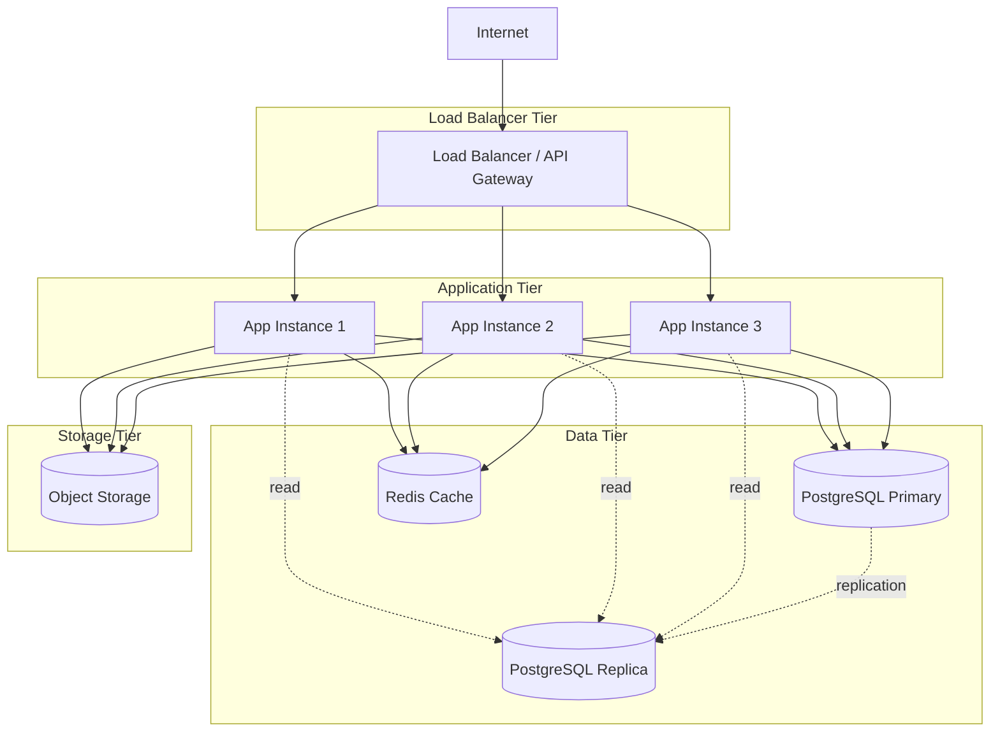

# Deployment Guide

Production deployment guide for Smart Reconciliation

## Table of Contents

1. [Deployment Overview](#deployment-overview)
2. [Prerequisites](#prerequisites)
3. [Environment Configuration](#environment-configuration)
4. [Docker Deployment](#docker-deployment)
5. [Kubernetes Deployment](#kubernetes-deployment)
6. [Cloud Platform Deployment](#cloud-platform-deployment)
7. [Database Setup](#database-setup)
8. [Monitoring and Logging](#monitoring-and-logging)
9. [Security Configuration](#security-configuration)
10. [Backup and Disaster Recovery](#backup-and-disaster-recovery)
11. [Scaling Strategy](#scaling-strategy)
12. [Troubleshooting](#troubleshooting)

---

## Deployment Overview

Smart Reconciliation can be deployed in various configurations:

- **Single Server** - Development or small-scale production
- **Docker Compose** - Simple containerized deployment
- **Kubernetes** - Scalable production deployment
- **Cloud Platforms** - AWS, Azure, GCP managed services

### Recommended Production Architecture



---

## Prerequisites

### Infrastructure Requirements

**Minimum Requirements (Single Instance):**
- CPU: 2 cores
- RAM: 4GB
- Disk: 50GB SSD
- OS: Ubuntu 22.04 LTS, Amazon Linux 2023, or RHEL 8+

**Recommended Production (Per Instance):**
- CPU: 4-8 cores
- RAM: 8-16GB
- Disk: 100GB SSD
- OS: Ubuntu 22.04 LTS

**Database Server:**
- CPU: 4-8 cores
- RAM: 16-32GB
- Disk: 500GB SSD with IOPS provisioning
- PostgreSQL 16 with PGVector extension

### Software Prerequisites

- Docker 24.0+ and Docker Compose 2.0+
- Java 21 JDK (if running without Docker)
- PostgreSQL 16 with PGVector extension
- (Optional) Kubernetes 1.28+
- (Optional) Helm 3.0+

### External Services

- AI Provider API access (Anthropic, OpenAI, or DeepSeek)
- SMTP server for email notifications (optional)
- Object storage (S3, Azure Blob, or MinIO)

---

## Environment Configuration

### Production Environment Variables

Create a secure `.env` file:

```bash
# Application
SPRING_PROFILES_ACTIVE=production
SERVER_PORT=8080

# Database
POSTGRES_HOST=db.example.com
POSTGRES_PORT=5432
POSTGRES_DB=smartreconciliation
POSTGRES_USER=smartrecon_app
POSTGRES_PASSWORD=<strong-password>

# AI Providers
ANTHROPIC_API_KEY=sk-ant-api03-xxxxx
OPENAI_API_KEY=sk-xxxxx
DEEPSEEK_API_KEY=xxxxx
AI_PROVIDER=anthropic

# File Storage
FILE_STORAGE_TYPE=s3
S3_BUCKET_NAME=smartreconciliation-files
S3_REGION=us-east-1
S3_ACCESS_KEY=AKIAXXXXX
S3_SECRET_KEY=xxxxx

# Security
JWT_SECRET=<random-256-bit-secret>
CORS_ALLOWED_ORIGINS=https://app.example.com,https://www.example.com

# Monitoring
MANAGEMENT_METRICS_EXPORT_PROMETHEUS_ENABLED=true
LOGGING_LEVEL_ROOT=INFO
LOGGING_LEVEL_COM_AMIT_SMARTRECONCILIATION=INFO

# Email (Optional)
MAIL_HOST=smtp.example.com
MAIL_PORT=587
MAIL_USERNAME=notifications@example.com
MAIL_PASSWORD=xxxxx
```

### Application Properties for Production

Create `application-production.properties`:

```properties
# Server Configuration
server.port=${SERVER_PORT:8080}
server.shutdown=graceful
spring.lifecycle.timeout-per-shutdown-phase=30s

# Database Configuration
spring.datasource.url=jdbc:postgresql://${POSTGRES_HOST}:${POSTGRES_PORT}/${POSTGRES_DB}
spring.datasource.username=${POSTGRES_USER}
spring.datasource.password=${POSTGRES_PASSWORD}
spring.datasource.driver-class-name=org.postgresql.Driver

# Connection Pool
spring.datasource.hikari.maximum-pool-size=20
spring.datasource.hikari.minimum-idle=5
spring.datasource.hikari.connection-timeout=20000
spring.datasource.hikari.idle-timeout=300000
spring.datasource.hikari.max-lifetime=1200000

# JPA Configuration
spring.jpa.hibernate.ddl-auto=validate
spring.jpa.show-sql=false
spring.jpa.properties.hibernate.format_sql=false
spring.jpa.properties.hibernate.dialect=org.hibernate.dialect.PostgreSQLDialect
spring.jpa.properties.hibernate.jdbc.batch_size=20
spring.jpa.properties.hibernate.order_inserts=true
spring.jpa.properties.hibernate.order_updates=true

# File Upload
spring.servlet.multipart.enabled=true
spring.servlet.multipart.max-file-size=100MB
spring.servlet.multipart.max-request-size=100MB

# File Storage
app.file.storage-type=${FILE_STORAGE_TYPE:local}
app.file.upload-dir=/app/uploads
app.file.s3.bucket-name=${S3_BUCKET_NAME}
app.file.s3.region=${S3_REGION}

# AI Configuration
app.ai.provider=${AI_PROVIDER:anthropic}
spring.ai.anthropic.api-key=${ANTHROPIC_API_KEY}
spring.ai.anthropic.chat.options.model=claude-sonnet-4-20250514
spring.ai.anthropic.chat.options.max-tokens=4096

# Security
app.security.jwt.secret=${JWT_SECRET}
app.security.jwt.expiration=86400000
app.cors.allowed-origins=${CORS_ALLOWED_ORIGINS}

# Async Configuration
spring.task.execution.pool.core-size=8
spring.task.execution.pool.max-size=16
spring.task.execution.pool.queue-capacity=200

# Logging
logging.level.root=INFO
logging.level.com.amit.smartreconciliation=${LOGGING_LEVEL_COM_AMIT_SMARTRECONCILIATION:INFO}
logging.level.org.springframework.ai=INFO
logging.pattern.console=%d{yyyy-MM-dd HH:mm:ss} - %msg%n
logging.file.name=/var/log/smartreconciliation/application.log
logging.file.max-size=100MB
logging.file.max-history=30

# Actuator
management.endpoints.web.exposure.include=health,info,metrics,prometheus
management.endpoint.health.show-details=when-authorized
management.metrics.export.prometheus.enabled=true
```

---

## Docker Deployment

### Build Docker Image

**Dockerfile:**

```dockerfile
# Build stage
FROM maven:3.9-eclipse-temurin-21-alpine AS build
WORKDIR /app
COPY pom.xml .
COPY src ./src
RUN mvn clean package -DskipTests

# Runtime stage
FROM eclipse-temurin:21-jre-alpine
WORKDIR /app

# Add non-root user
RUN addgroup -S spring && adduser -S spring -G spring
USER spring:spring

# Copy JAR from build stage
COPY --from=build /app/target/*.jar app.jar

# Expose port
EXPOSE 8080

# Health check
HEALTHCHECK --interval=30s --timeout=3s --start-period=40s --retries=3 \
  CMD wget --no-verbose --tries=1 --spider http://localhost:8080/actuator/health || exit 1

# Run application
ENTRYPOINT ["java", "-Djava.security.egd=file:/dev/./urandom", "-jar", "app.jar"]
```

**Build image:**

```bash
docker build -t smartreconciliation:latest .
```

**Tag for registry:**

```bash
docker tag smartreconciliation:latest registry.example.com/smartreconciliation:v1.0.0
docker push registry.example.com/smartreconciliation:v1.0.0
```

### Docker Compose Production Setup

**docker-compose.production.yml:**

```yaml
version: '3.8'

services:
  app:
    image: smartreconciliation:latest
    container_name: smartreconciliation-app
    restart: unless-stopped
    ports:
      - "8080:8080"
    environment:
      SPRING_PROFILES_ACTIVE: production
      POSTGRES_HOST: postgres
      POSTGRES_PORT: 5432
      POSTGRES_DB: smartreconciliation
      POSTGRES_USER: ${POSTGRES_USER}
      POSTGRES_PASSWORD: ${POSTGRES_PASSWORD}
      ANTHROPIC_API_KEY: ${ANTHROPIC_API_KEY}
      OPENAI_API_KEY: ${OPENAI_API_KEY}
    volumes:
      - ./uploads:/app/uploads
      - ./logs:/var/log/smartreconciliation
    depends_on:
      postgres:
        condition: service_healthy
      redis:
        condition: service_started
    networks:
      - app-network
    healthcheck:
      test: ["CMD", "wget", "--spider", "http://localhost:8080/actuator/health"]
      interval: 30s
      timeout: 10s
      retries: 3
      start_period: 40s

  postgres:
    image: pgvector/pgvector:pg16
    container_name: smartreconciliation-db
    restart: unless-stopped
    environment:
      POSTGRES_DB: ${POSTGRES_DB}
      POSTGRES_USER: ${POSTGRES_USER}
      POSTGRES_PASSWORD: ${POSTGRES_PASSWORD}
    volumes:
      - postgres_data:/var/lib/postgresql/data
      - ./scripts/init-db.sql:/docker-entrypoint-initdb.d/init.sql
    ports:
      - "5432:5432"
    networks:
      - app-network
    healthcheck:
      test: ["CMD-SHELL", "pg_isready -U ${POSTGRES_USER}"]
      interval: 10s
      timeout: 5s
      retries: 5

  redis:
    image: redis:7-alpine
    container_name: smartreconciliation-redis
    restart: unless-stopped
    ports:
      - "6379:6379"
    volumes:
      - redis_data:/data
    networks:
      - app-network
    command: redis-server --appendonly yes

  nginx:
    image: nginx:alpine
    container_name: smartreconciliation-nginx
    restart: unless-stopped
    ports:
      - "80:80"
      - "443:443"
    volumes:
      - ./nginx/nginx.conf:/etc/nginx/nginx.conf:ro
      - ./nginx/ssl:/etc/nginx/ssl:ro
    depends_on:
      - app
    networks:
      - app-network

volumes:
  postgres_data:
  redis_data:

networks:
  app-network:
    driver: bridge
```

**Deploy:**

```bash
# Start services
docker-compose -f docker-compose.production.yml up -d

# View logs
docker-compose -f docker-compose.production.yml logs -f app

# Stop services
docker-compose -f docker-compose.production.yml down

# Update application
docker-compose -f docker-compose.production.yml pull app
docker-compose -f docker-compose.production.yml up -d app
```

### NGINX Configuration

**nginx/nginx.conf:**

```nginx
upstream app_backend {
    least_conn;
    server app:8080 max_fails=3 fail_timeout=30s;
}

server {
    listen 80;
    server_name api.example.com;

    # Redirect to HTTPS
    return 301 https://$server_name$request_uri;
}

server {
    listen 443 ssl http2;
    server_name api.example.com;

    ssl_certificate /etc/nginx/ssl/cert.pem;
    ssl_certificate_key /etc/nginx/ssl/key.pem;
    ssl_protocols TLSv1.2 TLSv1.3;
    ssl_ciphers HIGH:!aNULL:!MD5;

    client_max_body_size 100M;

    # Security headers
    add_header X-Frame-Options "SAMEORIGIN" always;
    add_header X-Content-Type-Options "nosniff" always;
    add_header X-XSS-Protection "1; mode=block" always;
    add_header Strict-Transport-Security "max-age=31536000; includeSubDomains" always;

    location / {
        proxy_pass http://app_backend;
        proxy_set_header Host $host;
        proxy_set_header X-Real-IP $remote_addr;
        proxy_set_header X-Forwarded-For $proxy_add_x_forwarded_for;
        proxy_set_header X-Forwarded-Proto $scheme;

        # Timeouts
        proxy_connect_timeout 60s;
        proxy_send_timeout 60s;
        proxy_read_timeout 300s;

        # Buffering
        proxy_buffering on;
        proxy_buffer_size 4k;
        proxy_buffers 8 4k;
        proxy_busy_buffers_size 8k;
    }

    # WebSocket support for chat streaming
    location /api/v1/chat/stream {
        proxy_pass http://app_backend;
        proxy_http_version 1.1;
        proxy_set_header Upgrade $http_upgrade;
        proxy_set_header Connection "upgrade";
        proxy_set_header Host $host;
        proxy_cache_bypass $http_upgrade;
        proxy_read_timeout 3600s;
    }

    # Health check
    location /actuator/health {
        proxy_pass http://app_backend;
        access_log off;
    }
}
```

---

## Kubernetes Deployment

### Kubernetes Manifests

**namespace.yaml:**

```yaml
apiVersion: v1
kind: Namespace
metadata:
  name: smartreconciliation
```

**configmap.yaml:**

```yaml
apiVersion: v1
kind: ConfigMap
metadata:
  name: app-config
  namespace: smartreconciliation
data:
  application-production.properties: |
    spring.datasource.url=jdbc:postgresql://postgres-service:5432/smartreconciliation
    server.port=8080
    # ... other properties
```

**secret.yaml:**

```yaml
apiVersion: v1
kind: Secret
metadata:
  name: app-secrets
  namespace: smartreconciliation
type: Opaque
stringData:
  postgres-password: <base64-encoded>
  anthropic-api-key: <base64-encoded>
  openai-api-key: <base64-encoded>
  jwt-secret: <base64-encoded>
```

**deployment.yaml:**

```yaml
apiVersion: apps/v1
kind: Deployment
metadata:
  name: smartreconciliation-app
  namespace: smartreconciliation
spec:
  replicas: 3
  selector:
    matchLabels:
      app: smartreconciliation
  template:
    metadata:
      labels:
        app: smartreconciliation
    spec:
      containers:
      - name: app
        image: registry.example.com/smartreconciliation:v1.0.0
        ports:
        - containerPort: 8080
        env:
        - name: SPRING_PROFILES_ACTIVE
          value: "production"
        - name: POSTGRES_PASSWORD
          valueFrom:
            secretKeyRef:
              name: app-secrets
              key: postgres-password
        - name: ANTHROPIC_API_KEY
          valueFrom:
            secretKeyRef:
              name: app-secrets
              key: anthropic-api-key
        resources:
          requests:
            memory: "2Gi"
            cpu: "1000m"
          limits:
            memory: "4Gi"
            cpu: "2000m"
        livenessProbe:
          httpGet:
            path: /actuator/health/liveness
            port: 8080
          initialDelaySeconds: 60
          periodSeconds: 10
        readinessProbe:
          httpGet:
            path: /actuator/health/readiness
            port: 8080
          initialDelaySeconds: 30
          periodSeconds: 5
        volumeMounts:
        - name: config
          mountPath: /app/config
        - name: uploads
          mountPath: /app/uploads
      volumes:
      - name: config
        configMap:
          name: app-config
      - name: uploads
        persistentVolumeClaim:
          claimName: uploads-pvc
```

**service.yaml:**

```yaml
apiVersion: v1
kind: Service
metadata:
  name: app-service
  namespace: smartreconciliation
spec:
  selector:
    app: smartreconciliation
  ports:
  - protocol: TCP
    port: 80
    targetPort: 8080
  type: ClusterIP
```

**ingress.yaml:**

```yaml
apiVersion: networking.k8s.io/v1
kind: Ingress
metadata:
  name: app-ingress
  namespace: smartreconciliation
  annotations:
    cert-manager.io/cluster-issuer: letsencrypt-prod
    nginx.ingress.kubernetes.io/proxy-body-size: 100m
spec:
  ingressClassName: nginx
  tls:
  - hosts:
    - api.example.com
    secretName: app-tls
  rules:
  - host: api.example.com
    http:
      paths:
      - path: /
        pathType: Prefix
        backend:
          service:
            name: app-service
            port:
              number: 80
```

**Deploy to Kubernetes:**

```bash
# Create namespace
kubectl apply -f namespace.yaml

# Apply configurations
kubectl apply -f configmap.yaml
kubectl apply -f secret.yaml
kubectl apply -f deployment.yaml
kubectl apply -f service.yaml
kubectl apply -f ingress.yaml

# Check deployment
kubectl get pods -n smartreconciliation
kubectl logs -f deployment/smartreconciliation-app -n smartreconciliation

# Scale deployment
kubectl scale deployment smartreconciliation-app --replicas=5 -n smartreconciliation
```

### Helm Chart

**Chart.yaml:**

```yaml
apiVersion: v2
name: smartreconciliation
description: AI-powered reconciliation platform
type: application
version: 1.0.0
appVersion: "1.0.0"
```

**values.yaml:**

```yaml
replicaCount: 3

image:
  repository: registry.example.com/smartreconciliation
  tag: "v1.0.0"
  pullPolicy: IfNotPresent

service:
  type: ClusterIP
  port: 80

ingress:
  enabled: true
  className: nginx
  annotations:
    cert-manager.io/cluster-issuer: letsencrypt-prod
  hosts:
    - host: api.example.com
      paths:
        - path: /
          pathType: Prefix
  tls:
    - secretName: app-tls
      hosts:
        - api.example.com

resources:
  requests:
    memory: "2Gi"
    cpu: "1000m"
  limits:
    memory: "4Gi"
    cpu: "2000m"

autoscaling:
  enabled: true
  minReplicas: 3
  maxReplicas: 10
  targetCPUUtilizationPercentage: 70

postgresql:
  enabled: true
  auth:
    username: smartrecon
    password: changeme
    database: smartreconciliation
```

**Install with Helm:**

```bash
helm install smartreconciliation ./smartreconciliation-chart \
  --namespace smartreconciliation \
  --create-namespace \
  --values values.yaml

# Upgrade
helm upgrade smartreconciliation ./smartreconciliation-chart \
  --namespace smartreconciliation \
  --values values.yaml

# Rollback
helm rollback smartreconciliation 1 --namespace smartreconciliation
```

---

## Cloud Platform Deployment

### AWS Deployment

**Architecture:**

- **Compute**: ECS Fargate or EKS
- **Database**: RDS PostgreSQL with PGVector (using Babelfish or custom image)
- **Storage**: S3
- **Load Balancer**: Application Load Balancer
- **DNS**: Route 53
- **Certificates**: ACM

**ECS Task Definition:**

```json
{
  "family": "smartreconciliation",
  "networkMode": "awsvpc",
  "requiresCompatibilities": ["FARGATE"],
  "cpu": "2048",
  "memory": "4096",
  "containerDefinitions": [
    {
      "name": "app",
      "image": "123456789.dkr.ecr.us-east-1.amazonaws.com/smartreconciliation:latest",
      "portMappings": [
        {
          "containerPort": 8080,
          "protocol": "tcp"
        }
      ],
      "environment": [
        {
          "name": "SPRING_PROFILES_ACTIVE",
          "value": "production"
        }
      ],
      "secrets": [
        {
          "name": "POSTGRES_PASSWORD",
          "valueFrom": "arn:aws:secretsmanager:us-east-1:123:secret:db-password"
        }
      ],
      "logConfiguration": {
        "logDriver": "awslogs",
        "options": {
          "awslogs-group": "/ecs/smartreconciliation",
          "awslogs-region": "us-east-1",
          "awslogs-stream-prefix": "app"
        }
      }
    }
  ]
}
```

### Azure Deployment

**Services:**

- **Compute**: Azure Container Instances or AKS
- **Database**: Azure Database for PostgreSQL
- **Storage**: Azure Blob Storage
- **Load Balancer**: Azure Application Gateway
- **DNS**: Azure DNS

### GCP Deployment

**Services:**

- **Compute**: Cloud Run or GKE
- **Database**: Cloud SQL for PostgreSQL
- **Storage**: Cloud Storage
- **Load Balancer**: Cloud Load Balancing
- **DNS**: Cloud DNS

---

## Database Setup

### PostgreSQL Installation with PGVector

**Using Docker:**

```bash
docker run -d \
  --name postgres-pgvector \
  -e POSTGRES_PASSWORD=changeme \
  -e POSTGRES_DB=smartreconciliation \
  -v pgvector-data:/var/lib/postgresql/data \
  -p 5432:5432 \
  pgvector/pgvector:pg16
```

**Manual Installation:**

```bash
# Install PostgreSQL 16
sudo apt-get update
sudo apt-get install -y postgresql-16 postgresql-server-dev-16

# Install PGVector
cd /tmp
git clone https://github.com/pgvector/pgvector.git
cd pgvector
make
sudo make install

# Enable extension
sudo -u postgres psql -c "CREATE EXTENSION vector;"
```

### Database Initialization

**init-db.sql:**

```sql
-- Create database
CREATE DATABASE smartreconciliation;

-- Connect to database
\c smartreconciliation;

-- Enable extensions
CREATE EXTENSION IF NOT EXISTS vector;
CREATE EXTENSION IF NOT EXISTS "uuid-ossp";

-- Create application user
CREATE USER smartrecon_app WITH PASSWORD 'changeme';
GRANT ALL PRIVILEGES ON DATABASE smartreconciliation TO smartrecon_app;
GRANT ALL ON SCHEMA public TO smartrecon_app;
```

### Database Migration (Flyway)

Add Flyway to `pom.xml`:

```xml
<dependency>
    <groupId>org.flywaydb</groupId>
    <artifactId>flyway-core</artifactId>
</dependency>
```

**Migration scripts** in `src/main/resources/db/migration/`:

```sql
-- V1__initial_schema.sql
CREATE TABLE organizations (
    id BIGSERIAL PRIMARY KEY,
    name VARCHAR(255) NOT NULL,
    created_at TIMESTAMP NOT NULL DEFAULT NOW()
);

-- V2__add_reconciliations.sql
CREATE TABLE reconciliations (
    id BIGSERIAL PRIMARY KEY,
    name VARCHAR(255) NOT NULL,
    status VARCHAR(50) NOT NULL,
    organization_id BIGINT REFERENCES organizations(id),
    created_at TIMESTAMP NOT NULL DEFAULT NOW()
);
```

---

## Monitoring and Logging

### Prometheus Metrics

**prometheus.yml:**

```yaml
scrape_configs:
  - job_name: 'smartreconciliation'
    metrics_path: '/actuator/prometheus'
    static_configs:
      - targets: ['app:8080']
```

### Grafana Dashboard

Import Spring Boot dashboard (ID: 4701) and customize.

### Centralized Logging

**ELK Stack with Docker Compose:**

```yaml
elasticsearch:
  image: docker.elastic.co/elasticsearch/elasticsearch:8.11.0
  environment:
    - discovery.type=single-node

logstash:
  image: docker.elastic.co/logstash/logstash:8.11.0
  volumes:
    - ./logstash.conf:/usr/share/logstash/pipeline/logstash.conf

kibana:
  image: docker.elastic.co/kibana/kibana:8.11.0
  ports:
    - "5601:5601"
```

---

## Security Configuration

### TLS/SSL Setup

**Generate self-signed certificate (development):**

```bash
openssl req -x509 -newkey rsa:4096 -keyout key.pem -out cert.pem -days 365 -nodes
```

**Production:** Use Let's Encrypt with Certbot or cloud provider certificates.

### Secrets Management

**AWS Secrets Manager:**

```bash
aws secretsmanager create-secret \
  --name smartreconciliation/postgres-password \
  --secret-string "strong-password"
```

**Kubernetes Secrets:**

```bash
kubectl create secret generic app-secrets \
  --from-literal=postgres-password=changeme \
  --namespace=smartreconciliation
```

### Firewall Rules

```bash
# Allow HTTPS
sudo ufw allow 443/tcp

# Allow PostgreSQL from app servers only
sudo ufw allow from 10.0.1.0/24 to any port 5432
```

---

## Backup and Disaster Recovery

### Database Backup

**Automated backup script:**

```bash
#!/bin/bash
BACKUP_DIR="/backups/postgres"
DATE=$(date +%Y%m%d_%H%M%S)

docker exec smartreconciliation-db pg_dump -U postgres smartreconciliation | \
  gzip > "$BACKUP_DIR/backup_$DATE.sql.gz"

# Keep only last 30 days
find $BACKUP_DIR -name "backup_*.sql.gz" -mtime +30 -delete
```

**Cron job:**

```bash
0 2 * * * /opt/scripts/backup-database.sh
```

### File Storage Backup

**S3 to S3 replication or periodic snapshots**

### Disaster Recovery Plan

1. **RTO (Recovery Time Objective)**: 1 hour
2. **RPO (Recovery Point Objective)**: 15 minutes
3. **Backup frequency**: Daily full, hourly incremental
4. **Backup retention**: 30 days
5. **Test recovery**: Monthly

---

## Scaling Strategy

### Horizontal Pod Autoscaling (HPA)

```yaml
apiVersion: autoscaling/v2
kind: HorizontalPodAutoscaler
metadata:
  name: smartreconciliation-hpa
spec:
  scaleTargetRef:
    apiVersion: apps/v1
    kind: Deployment
    name: smartreconciliation-app
  minReplicas: 3
  maxReplicas: 10
  metrics:
  - type: Resource
    resource:
      name: cpu
      target:
        type: Utilization
        averageUtilization: 70
  - type: Resource
    resource:
      name: memory
      target:
        type: Utilization
        averageUtilization: 80
```

### Database Scaling

- **Read replicas** for read-heavy workloads
- **Connection pooling** (already configured with HikariCP)
- **Partitioning** for large tables
- **Sharding** for multi-tenant at scale

---

## Troubleshooting

### Application Won't Start

**Check logs:**
```bash
docker logs smartreconciliation-app
kubectl logs deployment/smartreconciliation-app -n smartreconciliation
```

**Common issues:**
- Database not accessible
- Missing environment variables
- Port conflicts

### High Memory Usage

**Adjust JVM settings:**

```dockerfile
ENTRYPOINT ["java", \
  "-Xms2g", \
  "-Xmx4g", \
  "-XX:+UseG1GC", \
  "-jar", "app.jar"]
```

### Database Connection Pool Exhausted

**Increase pool size:**

```properties
spring.datasource.hikari.maximum-pool-size=30
```

---

## Deployment Checklist

Before going live:

- [ ] Environment variables configured
- [ ] Database initialized and migrated
- [ ] TLS/SSL certificates installed
- [ ] Firewall rules configured
- [ ] Monitoring and logging set up
- [ ] Backup strategy implemented
- [ ] Load testing completed
- [ ] Security audit performed
- [ ] Disaster recovery plan documented
- [ ] Runbook created for operations team

---

For more information, see:
- [Operations Guide](operations-guide.md)
- [Configuration Reference](configuration-reference.md)
- [Database Documentation](database-schema.md)
