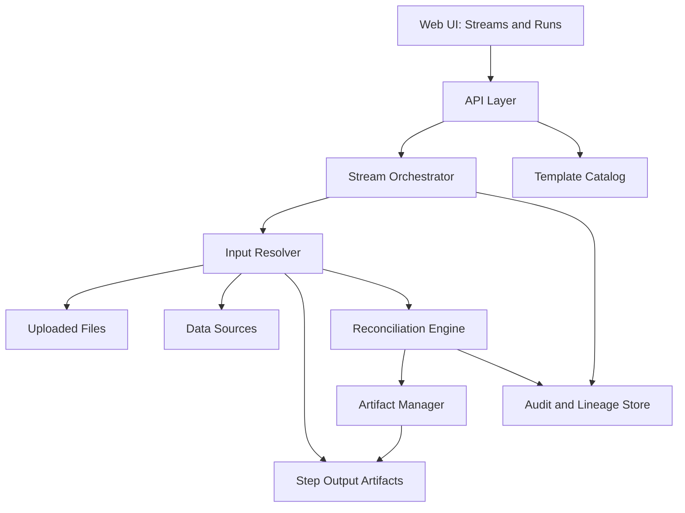

# Reconciliation Platform Pivot Plan (E-commerce First, Multi-Industry Expansion)

**Date:** 2026-02-21  
**Status:** Proposed  
**Audience:** Product, Architecture, Backend, Frontend, QA, Operations  
**Related docs:**
- `docs/02-architecture/reconciliation-pipelines.md`
- `docs/plans/2026-02-21-reconciliation-pipelines.md`

## 1. Executive Summary

This pivot is feasible and aligned with real reconciliation demand in e-commerce, supply chain, trading, and banking.  
The right execution model is:

1. Build one **core reconciliation platform**.
2. Start with one **beachhead vertical** (e-commerce payouts).
3. Productize cross-industry support through **templates**, not separate engines.
4. Keep current 1:1 reconciliation APIs working while introducing pipeline streams.

This avoids a risky "build everything for everyone now" approach while still moving toward a broad business platform.

## 2. Feasibility Assessment

### 2.1 What is already strong in the current system

1. File ingestion, parsing, and schema detection are already implemented.
2. Rule sets, field mappings, and matching rules already exist.
3. Exception management lifecycle already exists.
4. Async reconciliation execution already exists.
5. Multi-tenant organization scoping already exists.

### 2.2 What blocks the pivot today

1. Current reconciliation model is tightly coupled to `sourceFileId` and `targetFileId`.
2. No first-class runtime model for multi-step workflow orchestration.
3. No lineage model for step-level artifact chaining and audit history.
4. Frontend wizard and APIs are designed for only single-step runs.
5. AI system-knowledge prompt content still reflects old schema assumptions.

### 2.3 Conclusion

The pivot is technically feasible through incremental architecture upgrades, with low migration risk if backward compatibility is preserved.

## 3. Product Strategy and Scope

## 3.1 Business positioning

Position as a **reconciliation operations platform** that supports:

1. High-volume operational matching.
2. Exception triage and resolution workflows.
3. Audit-ready process traceability.
4. Domain template acceleration.

## 3.2 V1 scope (must-have)

1. Multi-step reconciliation streams (pipeline chaining).
2. Hybrid run triggers (scheduled + event-driven start).
3. Materialized intermediate artifacts (unmatched records).
4. End-to-end run and step audit lineage.
5. E-commerce template pack as first production domain.

## 3.3 V1 out of scope (explicitly deferred)

1. Full near-real-time streaming reconciliation.
2. Full regulated-maker-checker control framework.
3. Deep native connectors for all industries.

## 4. Target Architecture

## 4.1 Reference architecture

## 4.2 Core architectural changes

### A. Stream and run orchestration

Introduce workflow entities:

1. `ReconciliationStream` (design-time definition of a pipeline).
2. `ReconciliationStep` (ordered step definition).
3. `ReconciliationRun` (runtime execution of a stream).
4. `ReconciliationStepRun` (runtime execution state for each step).

### B. Input resolver abstraction

Introduce polymorphic input model:

1. `FILE`
2. `STEP_OUTPUT_UNMATCHED_SOURCE`
3. `STEP_OUTPUT_UNMATCHED_TARGET`
4. `DATA_SOURCE_SNAPSHOT`

`InputResolverService` should return a common `InputProvider` so the matching engine remains stateless.

### C. Artifact and lineage model

Persist output artifacts as first-class records:

1. Unmatched source artifact.
2. Unmatched target artifact.
3. Optional matched snapshot artifact.

Each artifact must include:

1. `artifactType`
2. `storagePath`
3. `checksum`
4. `rowCount`
5. `createdAt`
6. `retentionPolicy`

Lineage events should create immutable links:
- `stepRun -> artifact -> downstream stepRun`.

### D. Backward compatibility

Keep existing `/api/v1/reconciliations` behavior active.

Compatibility rule:
1. A legacy reconciliation is internally treated as a one-step stream run.
2. Existing request and response payloads remain valid for current frontend clients.

### E. Operational reliability

Run orchestration must support:

1. Step-level retry with backoff.
2. Idempotency keys per step run.
3. Stop-on-failure vs continue-on-noncritical policies.
4. Cancellation at run and step boundaries.
5. Dead-letter/error classification for failed runs.

## 4.3 Data model evolution (proposed)

Add tables:

1. `reconciliation_streams`
2. `reconciliation_steps`
3. `reconciliation_runs`
4. `reconciliation_step_runs`
5. `reconciliation_artifacts`
6. `reconciliation_lineage_events`
7. `reconciliation_templates`

Extend existing tables:

1. `reconciliations` with nullable links (`stream_run_id`, `step_run_id`) for compatibility.
2. `uploaded_files` metadata for generated artifacts and retention tagging.

## 4.4 API evolution (proposed endpoints)

New endpoints:

1. `POST /api/v1/streams` create stream.
2. `GET /api/v1/streams/{id}` stream definition.
3. `POST /api/v1/streams/{id}/runs` execute stream.
4. `GET /api/v1/stream-runs/{id}` run status and metrics.
5. `GET /api/v1/stream-runs/{id}/steps` step statuses.
6. `POST /api/v1/stream-runs/{id}/cancel` cancel active run.
7. `GET /api/v1/step-runs/{id}/artifacts` list downloadable artifacts.
8. `POST /api/v1/streams/{id}/validate` schema/rule/input readiness checks.

Existing endpoints to preserve:

1. `POST /api/v1/reconciliations`
2. `POST /api/v1/reconciliations/{id}/start`
3. `GET /api/v1/reconciliations/{id}`
4. Existing exceptions endpoints

## 4.5 Security, audit, and compliance baseline

V1 baseline controls:

1. Immutable run/step/audit event trail.
2. Artifact checksum and integrity verification.
3. Org-level isolation on all stream/run/artifact resources.
4. Action audit fields (`who`, `when`, `what`) for run operations.
5. Download authorization checks on intermediate artifacts.

## 5. Phase-wise Delivery Plan

## 5.1 Phase 0: Contract and discovery (1-2 weeks)

**Objective:** Freeze scope and contracts before implementation.

Deliverables:
1. Final API contracts for streams/runs/steps/artifacts.
2. ERD and migration plan for new entities.
3. Backward compatibility contract document.
4. E-commerce template specification.

Exit criteria:
1. Architecture and API review signed off.
2. No unresolved critical schema decisions.

## 5.2 Phase 1: Backend foundation (2-3 weeks)

**Objective:** Introduce new data model and basic orchestration skeleton.

Deliverables:
1. New entities/repositories/migrations.
2. Stream, step, run creation APIs.
3. Basic in-app orchestrator state machine.
4. Legacy one-step mapping adapter.

Exit criteria:
1. Stream definition can be created and validated.
2. Single-step runs execute end-to-end via new runtime path.

## 5.3 Phase 2: Resolver and artifact chaining (2-3 weeks)

**Objective:** Enable actual pipeline chaining with materialized outputs.

Deliverables:
1. `InputResolverService` with input provider strategy.
2. Artifact materialization and registration.
3. Step-to-step unmatched chaining.
4. Lineage event persistence.

Exit criteria:
1. 3-step pipeline executes automatically with no manual file re-upload.
2. All intermediate artifacts visible and downloadable.

## 5.4 Phase 3: Frontend streams UX (2-4 weeks)

**Objective:** Expose pipeline capabilities in product UX.

Deliverables:
1. Streams list and run history views.
2. Pipeline wizard for multi-step stream creation.
3. Step timeline and artifact access UI.
4. Dual mode support (`Quick Run` and `Pipeline Run`).

Exit criteria:
1. User can build, run, and inspect a stream from UI only.
2. Existing reconciliation UI remains operational.

## 5.5 Phase 4: Template productization (2-3 weeks)

**Objective:** Ship e-commerce-ready usable product flow.

Deliverables:
1. E-commerce payout template package.
2. Template cloning/customization in UI.
3. Recommended rule mappings and severity defaults.
4. Operator runbook and onboarding guide.

Exit criteria:
1. Template can be used on real sample settlement data.
2. Exception triage output is acceptable to finance ops users.

## 5.6 Phase 5: Hardening and scale readiness (2-4 weeks)

**Objective:** Improve reliability and enterprise confidence.

Deliverables:
1. Retry/backoff policy controls.
2. Idempotency and duplicate-trigger safety.
3. Performance tuning for 100k+ row steps.
4. Alerting and operational dashboards for stream runs.

Exit criteria:
1. SLA targets met in non-production load tests.
2. No critical audit or lineage gaps.

## 5.7 Phase 6: Industry expansion waves (ongoing)

**Objective:** Expand via template packs, not engine forks.

Wave plan:
1. Supply chain template pack.
2. Banking operations template pack.
3. Trading operations template pack.

Exit criteria:
1. Each new template reuses core runtime without custom engine branches.

## 6. Required Engineering Workstreams

1. **Backend domain model:** New stream/run/step/artifact entities and migrations.
2. **Orchestration runtime:** State machine, retries, idempotency, cancellation.
3. **Input abstraction:** Provider framework for file/result/data source inputs.
4. **Artifact lifecycle:** Generation, metadata, retention, download access.
5. **API contracts:** New stream endpoints + compatibility layer.
6. **Frontend product UX:** Stream management, wizard, run timeline.
7. **AI and prompts:** Update system-knowledge and template prompt sets.
8. **Observability:** Metrics, logs, traces, and run health dashboards.
9. **QA and performance:** Regression, integration, and load test coverage.

## 7. Test and Validation Strategy

## 7.1 Functional tests

1. Stream CRUD and validation behavior.
2. Step execution ordering and dependency handling.
3. Cancel, retry, and rerun flows.
4. Legacy reconciliation endpoint compatibility.

## 7.2 Integration tests

1. 3-step e-commerce pipeline happy path.
2. Mid-step failure with retry and recovery.
3. Input resolution from prior unmatched artifacts.
4. Artifact download and access control.

## 7.3 Non-functional tests

1. 100k+ row performance benchmarks.
2. Concurrency tests with parallel stream runs.
3. Storage growth and retention behavior checks.
4. Audit and lineage integrity verification.

## 7.4 Business acceptance tests

1. E-commerce settlement discrepancy scenarios.
2. Duplicate and missing-record exception workflows.
3. Analyst workflow timing and triage quality.

## 8. Rollout and Change Management

1. Release in feature-flag mode for stream functionality.
2. Keep old reconciliation workflow enabled by default during transition.
3. Run pilot accounts on e-commerce template before broad release.
4. Publish migration guide for API consumers and internal teams.
5. Deprecate old-only paths only after parity and adoption metrics are met.

## 9. Success Metrics

Product metrics:
1. % reduction in manual re-upload and handoff steps.
2. Time-to-close for exceptions in multi-step processes.
3. Stream template adoption rate.
4. Net reconciliation throughput (runs/day).

Engineering metrics:
1. Stream run success rate.
2. Retry recovery success rate.
3. P95 run duration by template.
4. Artifact integrity check pass rate.

## 10. Key Risks and Mitigations

1. **Scope creep:** "Solve all industries at once."
   - Mitigation: enforce template-wave roadmap with strict phase gates.
2. **Operational complexity:** orchestrator reliability issues.
   - Mitigation: start with in-app state machine, strict retry/idempotency controls.
3. **Compatibility regressions:** old UI/API breakage.
   - Mitigation: explicit compatibility adapter and regression tests.
4. **Audit gaps:** insufficient lineage for finance/compliance review.
   - Mitigation: immutable lineage events plus artifact checksums.

## 11. Locked Assumptions and Defaults

1. Beachhead vertical is **E-commerce payouts**.
2. Product model is **Core platform + templates**.
3. Execution default is **Hybrid scheduled batch + event triggers**.
4. API strategy is **Backward-compatible evolution**.
5. Orchestration is **In-app state machine + scheduler** for v1.
6. Compliance target is **Strong audit baseline**, not full regulated-control suite in v1.

