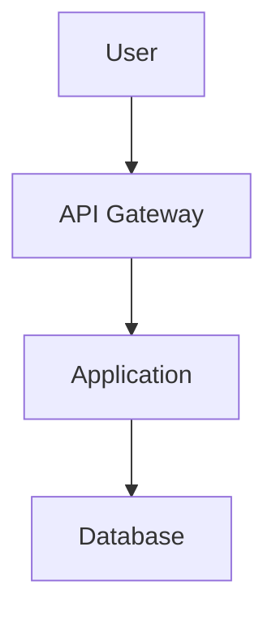

# Smart Reconciliation Documentation

Comprehensive technical documentation for the Smart Reconciliation platform.

## Documentation Structure

This documentation suite provides complete coverage of the Smart Reconciliation system from development to operations.

### Quick Links

| Document | Description | Audience |
|----------|-------------|----------|
| [Product Requirements](product-requirements.md) | Product overview, features, and roadmap | Product Managers, Stakeholders |
| [API Reference](api-reference.md) | Complete REST API documentation | Developers, Integrators |
| [Architecture](architecture.md) | System architecture and design | Architects, Senior Developers |
| [Developer Guide](developer-guide.md) | Development setup and guidelines | Developers |
| [Deployment Guide](deployment-guide.md) | Production deployment instructions | DevOps, SRE |
| [Database Schema](database-schema.md) | Complete database documentation | DBAs, Backend Developers |
| [Configuration Reference](configuration-reference.md) | All configuration options | Administrators, DevOps |
| [AI Integration Guide](ai-integration-guide.md) | AI features and Spring AI usage | Developers, ML Engineers |
| [Operations Guide](operations-guide.md) | Day-to-day operations and troubleshooting | Operations, Support |

---

## Getting Started

### For New Developers

1. Read [Developer Guide](developer-guide.md) - Set up your environment
2. Review [Architecture](architecture.md) - Understand the system design
3. Study [API Reference](api-reference.md) - Learn the API endpoints
4. Explore [AI Integration Guide](ai-integration-guide.md) - Understand AI features

**First Task:**
Follow the Developer Guide to get the application running locally, then try uploading a file and running a reconciliation.

### For DevOps/SRE

1. Read [Deployment Guide](deployment-guide.md) - Deployment options
2. Review [Configuration Reference](configuration-reference.md) - Configuration options
3. Study [Operations Guide](operations-guide.md) - Daily operations
4. Check [Database Schema](database-schema.md) - Database setup

**First Task:**
Deploy the application to a test environment using Docker Compose, then set up monitoring with Prometheus and Grafana.

### For Integrators

1. Read [API Reference](api-reference.md) - API endpoints and examples
2. Review [Architecture](architecture.md) - Integration points
3. Check [Configuration Reference](configuration-reference.md) - Authentication setup

**First Task:**
Test the file upload and reconciliation API endpoints using Postman or curl.

---

## Documentation Overview

### 1. Product Requirements Document

**File:** [product-requirements.md](product-requirements.md)

Comprehensive product requirements and strategic planning:
- Executive summary and product vision
- Target user personas
- Current features and capabilities
- Success metrics and KPIs
- Competitive analysis
- Future improvements and roadmap
- Strategic phases (NOW, NEXT, LATER)

**Key Sections:**
- Problem statement and solution
- 10 prioritized improvements
- 3-phase strategic roadmap
- Risk mitigation strategies
- Complete API endpoint inventory
- Codebase summary

### 2. API Reference

**File:** [api-reference.md](api-reference.md)

Complete REST API documentation including:
- All endpoints with request/response examples
- Authentication and authorization
- Error codes and handling
- Rate limiting and pagination
- OpenAPI-style reference

**Key Sections:**
- File Management
- Reconciliation
- Rules Management
- Exception Management
- AI Services
- Chat Interface
- Data Sources

### 3. Architecture Documentation

**File:** [architecture.md](architecture.md)

System architecture and design documentation:
- C4 model diagrams (context, container, component)
- Component details and responsibilities
- Data flow diagrams
- Technology stack
- Integration points
- Scalability considerations

**Key Diagrams:**
- System context
- Container architecture
- Reconciliation engine
- AI integration
- Data flow sequences

### 4. Developer Guide

**File:** [developer-guide.md](developer-guide.md)

Complete development guide:
- Development environment setup
- Project structure
- Code organization
- Development workflow
- Testing strategies
- Code style and standards
- Common development tasks

**Includes:**
- Prerequisites and installation
- Micro-step development process
- Testing examples
- Troubleshooting

### 5. Deployment Guide

**File:** [deployment-guide.md](deployment-guide.md)

Production deployment instructions:
- Docker deployment
- Kubernetes deployment
- Cloud platform deployment (AWS, Azure, GCP)
- Database setup
- Monitoring and logging
- Security configuration
- Backup and disaster recovery

**Deployment Options:**
- Single server
- Docker Compose
- Kubernetes with Helm
- AWS ECS/EKS
- Azure Container Instances
- Google Cloud Run

### 6. Database Schema

**File:** [database-schema.md](database-schema.md)

Complete database documentation:
- Entity relationship diagrams
- Table definitions with all columns
- Indexes and constraints
- JSONB column structures
- PGVector configuration
- Data migration strategies
- Performance optimization

**Covers:**
- 11 main tables
- Relationships and foreign keys
- Sample queries
- Backup procedures

### 7. Configuration Reference

**File:** [configuration-reference.md](configuration-reference.md)

All configuration options documented:
- Application configuration
- Database configuration
- AI provider configuration
- File upload configuration
- Security configuration
- Performance tuning
- Logging configuration
- Monitoring configuration

**Includes:**
- Property descriptions
- Default values
- Environment-specific configs
- Best practices

### 8. AI Integration Guide

**File:** [ai-integration-guide.md](ai-integration-guide.md)

AI capabilities and implementation:
- Spring AI framework
- AI provider comparison (Anthropic, OpenAI, DeepSeek)
- Field mapping suggestions
- Rule generation
- Exception resolution
- Chat interface
- Vector store integration
- Prompt engineering

**Topics:**
- Provider setup
- ChatClient API usage
- Streaming responses
- Cost management
- Best practices

### 9. Operations Guide

**File:** [operations-guide.md](operations-guide.md)

Day-to-day operations:
- Daily health checks
- Monitoring and alerting
- Backup and recovery procedures
- Performance tuning
- Troubleshooting common issues
- Maintenance tasks
- Security operations
- Incident response

**Includes:**
- Runbooks
- Health check procedures
- Incident severity levels
- Recovery procedures

---

## Documentation Standards

### Document Structure

All documentation follows this structure:

1. **Title** - Clear, descriptive title
2. **Table of Contents** - For easy navigation
3. **Overview** - Brief introduction
4. **Main Content** - Organized in logical sections
5. **Examples** - Code examples and diagrams where applicable
6. **Related Links** - Cross-references to other docs

### Diagrams

We use Mermaid for diagrams:
- Architecture diagrams
- Sequence diagrams
- Entity relationship diagrams
- Flowcharts

**Example:**

### Code Examples

All code examples include:
- Language specification for syntax highlighting
- Comments explaining key points
- Complete, runnable examples where possible

### Versioning

Documentation is versioned with the application:
- **Current Version:** 0.0.1-SNAPSHOT
- **Last Updated:** 2026-01-31

---

## Contributing to Documentation

### Documentation Guidelines

1. **Clarity** - Write for your audience
2. **Accuracy** - Verify all technical details
3. **Completeness** - Cover all aspects
4. **Examples** - Include practical examples
5. **Maintainability** - Keep it up to date

### Updating Documentation

When code changes:
1. Update relevant documentation
2. Add new sections if needed
3. Update diagrams if architecture changes
4. Review related documents
5. Test all code examples

### Documentation Review

Before committing documentation changes:
- [ ] Check for spelling and grammar
- [ ] Verify all code examples work
- [ ] Ensure diagrams render correctly
- [ ] Update table of contents if needed
- [ ] Cross-check related documents
- [ ] Verify all links work

---

## Glossary

### Common Terms

| Term | Definition |
|------|------------|
| **Reconciliation** | Process of matching records between two data sources |
| **Field Mapping** | Definition of how source fields map to target fields |
| **Matching Rule** | Logic for determining if two records match |
| **Exception** | Unmatched or problematic record pair |
| **Rule Set** | Collection of field mappings and matching rules |
| **PGVector** | PostgreSQL extension for vector similarity search |
| **Spring AI** | Spring framework for AI integration |
| **ChatClient** | Spring AI abstraction for AI chat interactions |

### Acronyms

| Acronym | Full Form |
|---------|-----------|
| **API** | Application Programming Interface |
| **REST** | Representational State Transfer |
| **CRUD** | Create, Read, Update, Delete |
| **JPA** | Java Persistence API |
| **DTO** | Data Transfer Object |
| **JSON** | JavaScript Object Notation |
| **JWT** | JSON Web Token |
| **CORS** | Cross-Origin Resource Sharing |
| **RTO** | Recovery Time Objective |
| **RPO** | Recovery Point Objective |
| **RAG** | Retrieval-Augmented Generation |
| **LLM** | Large Language Model |

---

## FAQ

### General

**Q: What is Smart Reconciliation?**

A: An AI-powered platform for automating data reconciliation between different systems and file formats.

**Q: What file formats are supported?**

A: CSV, Excel (.xlsx, .xls), JSON, and XML.

**Q: Which databases are supported?**

A: PostgreSQL is the primary database. The system can connect to PostgreSQL, MySQL, SQL Server, and Oracle as data sources.

### Development

**Q: Do I need Maven installed?**

A: No, the project uses Maven Wrapper (`mvnw.cmd` on Windows, `./mvnw` on Unix).

**Q: Which Java version is required?**

A: Java 21 (LTS).

**Q: How do I run tests?**

A: `mvnw.cmd test` (Windows) or `./mvnw test` (Unix/Linux/macOS).

### AI Features

**Q: Which AI provider should I use?**

A: Anthropic Claude is the primary provider, offering the best balance of accuracy and capability for reconciliation tasks. OpenAI is a good alternative, and DeepSeek is cost-effective for high-volume operations.

**Q: Do I need API keys for all providers?**

A: No, only for the provider you select. Set `app.ai.provider=anthropic` and provide only the Anthropic API key.

**Q: How much do AI calls cost?**

A: Costs vary by provider. Typical reconciliation tasks cost $0.01-0.05 per reconciliation depending on file size and complexity.

### Deployment

**Q: Can I run this without Docker?**

A: Yes, but you need to install PostgreSQL with PGVector extension manually.

**Q: Is Kubernetes required?**

A: No, Kubernetes is optional for production scaling. Docker Compose works for smaller deployments.

**Q: How do I enable HTTPS?**

A: Configure SSL in application.properties or use a reverse proxy like NGINX with SSL certificates.

---

## Support

### Getting Help

1. **Documentation** - Check this documentation first
2. **GitHub Issues** - Report bugs or request features
3. **Stack Overflow** - Ask questions with tag `smart-reconciliation`
4. **Email Support** - support@example.com (if available)

### Reporting Issues

When reporting issues, include:
- Smart Reconciliation version
- Java version
- Operating system
- Steps to reproduce
- Error messages and logs
- Expected vs actual behavior

---

## Version History

### Current Version: 0.0.1-SNAPSHOT

**Documentation Updates:**

- 2026-01-31: Initial comprehensive documentation release
  - API Reference
  - Architecture Documentation
  - Developer Guide
  - Deployment Guide
  - Database Schema
  - Configuration Reference
  - AI Integration Guide
  - Operations Guide

---

## License

This documentation is part of the Smart Reconciliation project.

Proprietary - All rights reserved.

---

## Next Steps

Based on your role, here's where to start:

**Developers:**
→ [Developer Guide](developer-guide.md) → [Architecture](architecture.md) → [API Reference](api-reference.md)

**DevOps/SRE:**
→ [Deployment Guide](deployment-guide.md) → [Operations Guide](operations-guide.md) → [Configuration Reference](configuration-reference.md)

**Database Administrators:**
→ [Database Schema](database-schema.md) → [Deployment Guide](deployment-guide.md) → [Operations Guide](operations-guide.md)

**Architects:**
→ [Architecture](architecture.md) → [AI Integration Guide](ai-integration-guide.md) → [API Reference](api-reference.md)

**Product Managers:**
→ [Product Requirements](product-requirements.md) → [API Reference](api-reference.md) → [AI Integration Guide](ai-integration-guide.md)

---

Happy learning! If you have questions or need clarification, please refer to the relevant detailed documentation or contact the development team.
