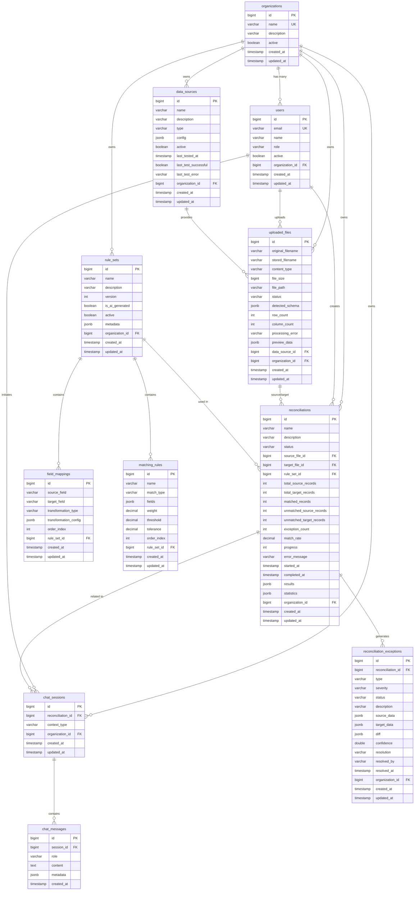

# Database Schema Documentation

Complete database schema reference for Smart Reconciliation

## Table of Contents

1. [Overview](#overview)
2. [Entity Relationship Diagram](#entity-relationship-diagram)
3. [Table Definitions](#table-definitions)
4. [Indexes and Constraints](#indexes-and-constraints)
5. [JSONB Column Structures](#jsonb-column-structures)
6. [PGVector Configuration](#pgvector-configuration)
7. [Data Migration](#data-migration)
8. [Performance Optimization](#performance-optimization)
9. [Backup and Maintenance](#backup-and-maintenance)

---

## Overview

Smart Reconciliation uses PostgreSQL 16 with the PGVector extension for vector storage and semantic search capabilities. The database follows a multi-tenant architecture with organization-level data isolation.

### Database Configuration

- **Database Name**: `smartreconciliation` (configurable)
- **Extensions**: `vector`, `uuid-ossp`
- **Character Set**: UTF-8
- **Collation**: en_US.UTF-8
- **PostgreSQL Version**: 16+
- **PGVector Version**: Latest

### Key Features

- Multi-tenant architecture via `organization_id`
- JSONB columns for flexible schema storage
- Audit timestamps on all tables (`created_at`, `updated_at`)
- Soft deletes via `active` flag where appropriate
- Vector embeddings for AI-powered search

---

## Entity Relationship Diagram



---

## Table Definitions

### 1. organizations

Multi-tenant container for all data.

```sql
CREATE TABLE organizations (
    id BIGSERIAL PRIMARY KEY,
    name VARCHAR(255) NOT NULL UNIQUE,
    description TEXT,
    active BOOLEAN NOT NULL DEFAULT TRUE,
    created_at TIMESTAMP NOT NULL DEFAULT NOW(),
    updated_at TIMESTAMP NOT NULL DEFAULT NOW()
);

CREATE INDEX idx_organizations_active ON organizations(active);
```

**Columns:**

| Column | Type | Nullable | Default | Description |
|--------|------|----------|---------|-------------|
| id | BIGSERIAL | NO | AUTO | Primary key |
| name | VARCHAR(255) | NO | - | Organization name (unique) |
| description | TEXT | YES | NULL | Organization description |
| active | BOOLEAN | NO | TRUE | Active/inactive flag |
| created_at | TIMESTAMP | NO | NOW() | Record creation timestamp |
| updated_at | TIMESTAMP | NO | NOW() | Record last update timestamp |

---

### 2. users

System users with role-based access.

```sql
CREATE TABLE users (
    id BIGSERIAL PRIMARY KEY,
    email VARCHAR(255) NOT NULL UNIQUE,
    name VARCHAR(255) NOT NULL,
    role VARCHAR(50) NOT NULL DEFAULT 'VIEWER',
    active BOOLEAN NOT NULL DEFAULT TRUE,
    organization_id BIGINT NOT NULL,
    created_at TIMESTAMP NOT NULL DEFAULT NOW(),
    updated_at TIMESTAMP NOT NULL DEFAULT NOW(),
    CONSTRAINT fk_users_organization FOREIGN KEY (organization_id)
        REFERENCES organizations(id) ON DELETE CASCADE
);

CREATE INDEX idx_users_email ON users(email);
CREATE INDEX idx_users_organization ON users(organization_id);
CREATE INDEX idx_users_active ON users(active);
```

**Columns:**

| Column | Type | Nullable | Default | Description |
|--------|------|----------|---------|-------------|
| id | BIGSERIAL | NO | AUTO | Primary key |
| email | VARCHAR(255) | NO | - | User email (unique) |
| name | VARCHAR(255) | NO | - | User display name |
| role | VARCHAR(50) | NO | VIEWER | User role (ADMIN, EDITOR, VIEWER) |
| active | BOOLEAN | NO | TRUE | Active/inactive flag |
| organization_id | BIGINT | NO | - | Foreign key to organizations |
| created_at | TIMESTAMP | NO | NOW() | Record creation timestamp |
| updated_at | TIMESTAMP | NO | NOW() | Record last update timestamp |

**Enum Values for `role`:**
- `ADMIN` - Full access
- `EDITOR` - Can create and edit
- `VIEWER` - Read-only access

---

### 3. data_sources

External data source connection configurations.

```sql
CREATE TABLE data_sources (
    id BIGSERIAL PRIMARY KEY,
    name VARCHAR(255) NOT NULL,
    description TEXT,
    type VARCHAR(50) NOT NULL,
    config JSONB,
    active BOOLEAN NOT NULL DEFAULT TRUE,
    last_tested_at TIMESTAMP,
    last_test_successful BOOLEAN,
    last_test_error TEXT,
    organization_id BIGINT NOT NULL,
    created_at TIMESTAMP NOT NULL DEFAULT NOW(),
    updated_at TIMESTAMP NOT NULL DEFAULT NOW(),
    CONSTRAINT fk_datasources_organization FOREIGN KEY (organization_id)
        REFERENCES organizations(id) ON DELETE CASCADE
);

CREATE INDEX idx_datasources_organization ON data_sources(organization_id);
CREATE INDEX idx_datasources_type ON data_sources(type);
CREATE INDEX idx_datasources_active ON data_sources(active);
```

**Columns:**

| Column | Type | Nullable | Default | Description |
|--------|------|----------|---------|-------------|
| id | BIGSERIAL | NO | AUTO | Primary key |
| name | VARCHAR(255) | NO | - | Data source name |
| description | TEXT | YES | NULL | Data source description |
| type | VARCHAR(50) | NO | - | Type (DATABASE, REST_API, FILE, WEBHOOK) |
| config | JSONB | YES | NULL | Connection configuration (credentials, URLs, etc.) |
| active | BOOLEAN | NO | TRUE | Active/inactive flag |
| last_tested_at | TIMESTAMP | YES | NULL | Last connection test timestamp |
| last_test_successful | BOOLEAN | YES | NULL | Last test result |
| last_test_error | TEXT | YES | NULL | Last test error message |
| organization_id | BIGINT | NO | - | Foreign key to organizations |
| created_at | TIMESTAMP | NO | NOW() | Record creation timestamp |
| updated_at | TIMESTAMP | NO | NOW() | Record last update timestamp |

**Enum Values for `type`:**
- `DATABASE` - Database connection
- `REST_API` - REST API endpoint
- `FILE` - File-based source
- `WEBHOOK` - Webhook receiver

---

### 4. uploaded_files

Metadata for uploaded files.

```sql
CREATE TABLE uploaded_files (
    id BIGSERIAL PRIMARY KEY,
    original_filename VARCHAR(500) NOT NULL,
    stored_filename VARCHAR(500) NOT NULL,
    content_type VARCHAR(100) NOT NULL,
    file_size BIGINT NOT NULL,
    file_path VARCHAR(1000),
    status VARCHAR(50) NOT NULL DEFAULT 'UPLOADING',
    detected_schema JSONB,
    row_count INTEGER,
    column_count INTEGER,
    processing_error TEXT,
    preview_data JSONB,
    data_source_id BIGINT,
    organization_id BIGINT NOT NULL,
    created_at TIMESTAMP NOT NULL DEFAULT NOW(),
    updated_at TIMESTAMP NOT NULL DEFAULT NOW(),
    CONSTRAINT fk_uploadedfiles_datasource FOREIGN KEY (data_source_id)
        REFERENCES data_sources(id) ON DELETE SET NULL,
    CONSTRAINT fk_uploadedfiles_organization FOREIGN KEY (organization_id)
        REFERENCES organizations(id) ON DELETE CASCADE
);

CREATE INDEX idx_uploadedfiles_organization ON uploaded_files(organization_id);
CREATE INDEX idx_uploadedfiles_status ON uploaded_files(status);
CREATE INDEX idx_uploadedfiles_created ON uploaded_files(created_at DESC);
```

**Columns:**

| Column | Type | Nullable | Default | Description |
|--------|------|----------|---------|-------------|
| id | BIGSERIAL | NO | AUTO | Primary key |
| original_filename | VARCHAR(500) | NO | - | Original file name |
| stored_filename | VARCHAR(500) | NO | - | Stored file name (UUID-based) |
| content_type | VARCHAR(100) | NO | - | MIME type |
| file_size | BIGINT | NO | - | File size in bytes |
| file_path | VARCHAR(1000) | YES | NULL | Storage path |
| status | VARCHAR(50) | NO | UPLOADING | Processing status |
| detected_schema | JSONB | YES | NULL | Auto-detected column schema |
| row_count | INTEGER | YES | NULL | Number of rows |
| column_count | INTEGER | YES | NULL | Number of columns |
| processing_error | TEXT | YES | NULL | Error message if processing failed |
| preview_data | JSONB | YES | NULL | Preview rows (first 100) |
| data_source_id | BIGINT | YES | NULL | Foreign key to data_sources |
| organization_id | BIGINT | NO | - | Foreign key to organizations |
| created_at | TIMESTAMP | NO | NOW() | Record creation timestamp |
| updated_at | TIMESTAMP | NO | NOW() | Record last update timestamp |

**Enum Values for `status`:**
- `UPLOADING` - File upload in progress
- `PROCESSING` - Parsing and schema detection in progress
- `PROCESSED` - Successfully processed
- `FAILED` - Processing failed

---

### 5. rule_sets

Collections of field mappings and matching rules.

```sql
CREATE TABLE rule_sets (
    id BIGSERIAL PRIMARY KEY,
    name VARCHAR(255) NOT NULL,
    description TEXT,
    version INTEGER NOT NULL DEFAULT 1,
    is_ai_generated BOOLEAN NOT NULL DEFAULT FALSE,
    active BOOLEAN NOT NULL DEFAULT TRUE,
    metadata JSONB,
    organization_id BIGINT NOT NULL,
    created_at TIMESTAMP NOT NULL DEFAULT NOW(),
    updated_at TIMESTAMP NOT NULL DEFAULT NOW(),
    CONSTRAINT fk_rulesets_organization FOREIGN KEY (organization_id)
        REFERENCES organizations(id) ON DELETE CASCADE
);

CREATE INDEX idx_rulesets_organization ON rule_sets(organization_id);
CREATE INDEX idx_rulesets_active ON rule_sets(active);
CREATE INDEX idx_rulesets_ai_generated ON rule_sets(is_ai_generated);
```

**Columns:**

| Column | Type | Nullable | Default | Description |
|--------|------|----------|---------|-------------|
| id | BIGSERIAL | NO | AUTO | Primary key |
| name | VARCHAR(255) | NO | - | Rule set name |
| description | TEXT | YES | NULL | Rule set description |
| version | INTEGER | NO | 1 | Version number |
| is_ai_generated | BOOLEAN | NO | FALSE | Whether rule set was AI-generated |
| active | BOOLEAN | NO | TRUE | Active/inactive flag |
| metadata | JSONB | YES | NULL | Additional metadata |
| organization_id | BIGINT | NO | - | Foreign key to organizations |
| created_at | TIMESTAMP | NO | NOW() | Record creation timestamp |
| updated_at | TIMESTAMP | NO | NOW() | Record last update timestamp |

---

### 6. field_mappings

Field-to-field mapping definitions.

```sql
CREATE TABLE field_mappings (
    id BIGSERIAL PRIMARY KEY,
    source_field VARCHAR(255) NOT NULL,
    target_field VARCHAR(255) NOT NULL,
    transformation_type VARCHAR(50) NOT NULL DEFAULT 'DIRECT',
    transformation_config JSONB,
    order_index INTEGER NOT NULL DEFAULT 0,
    rule_set_id BIGINT NOT NULL,
    created_at TIMESTAMP NOT NULL DEFAULT NOW(),
    updated_at TIMESTAMP NOT NULL DEFAULT NOW(),
    CONSTRAINT fk_fieldmappings_ruleset FOREIGN KEY (rule_set_id)
        REFERENCES rule_sets(id) ON DELETE CASCADE
);

CREATE INDEX idx_fieldmappings_ruleset ON field_mappings(rule_set_id);
CREATE INDEX idx_fieldmappings_order ON field_mappings(rule_set_id, order_index);
```

**Columns:**

| Column | Type | Nullable | Default | Description |
|--------|------|----------|---------|-------------|
| id | BIGSERIAL | NO | AUTO | Primary key |
| source_field | VARCHAR(255) | NO | - | Source column name |
| target_field | VARCHAR(255) | NO | - | Target column name |
| transformation_type | VARCHAR(50) | NO | DIRECT | Transformation to apply |
| transformation_config | JSONB | YES | NULL | Transformation parameters |
| order_index | INTEGER | NO | 0 | Execution order |
| rule_set_id | BIGINT | NO | - | Foreign key to rule_sets |
| created_at | TIMESTAMP | NO | NOW() | Record creation timestamp |
| updated_at | TIMESTAMP | NO | NOW() | Record last update timestamp |

**Enum Values for `transformation_type`:**
- `DIRECT` - No transformation
- `UPPERCASE` - Convert to uppercase
- `LOWERCASE` - Convert to lowercase
- `TRIM` - Trim whitespace
- `DATE_FORMAT` - Convert date format
- `CURRENCY_CONVERSION` - Convert currency

---

### 7. matching_rules

Matching logic definitions.

```sql
CREATE TABLE matching_rules (
    id BIGSERIAL PRIMARY KEY,
    name VARCHAR(255) NOT NULL,
    match_type VARCHAR(50) NOT NULL,
    fields JSONB NOT NULL,
    weight DECIMAL(3,2) NOT NULL DEFAULT 1.0,
    threshold DECIMAL(3,2),
    tolerance DECIMAL(10,4),
    order_index INTEGER NOT NULL DEFAULT 0,
    rule_set_id BIGINT NOT NULL,
    created_at TIMESTAMP NOT NULL DEFAULT NOW(),
    updated_at TIMESTAMP NOT NULL DEFAULT NOW(),
    CONSTRAINT fk_matchingrules_ruleset FOREIGN KEY (rule_set_id)
        REFERENCES rule_sets(id) ON DELETE CASCADE
);

CREATE INDEX idx_matchingrules_ruleset ON matching_rules(rule_set_id);
CREATE INDEX idx_matchingrules_order ON matching_rules(rule_set_id, order_index);
```

**Columns:**

| Column | Type | Nullable | Default | Description |
|--------|------|----------|---------|-------------|
| id | BIGSERIAL | NO | AUTO | Primary key |
| name | VARCHAR(255) | NO | - | Rule name |
| match_type | VARCHAR(50) | NO | - | Type of matching logic |
| fields | JSONB | NO | - | Array of field names to match |
| weight | DECIMAL(3,2) | NO | 1.0 | Match weight (0.0-1.0) |
| threshold | DECIMAL(3,2) | YES | NULL | Similarity threshold for fuzzy matching |
| tolerance | DECIMAL(10,4) | YES | NULL | Numeric tolerance for range matching |
| order_index | INTEGER | NO | 0 | Execution order |
| rule_set_id | BIGINT | NO | - | Foreign key to rule_sets |
| created_at | TIMESTAMP | NO | NOW() | Record creation timestamp |
| updated_at | TIMESTAMP | NO | NOW() | Record last update timestamp |

**Enum Values for `match_type`:**
- `EXACT` - Exact match
- `FUZZY` - Fuzzy string matching
- `RANGE` - Numeric range match
- `DATE_RANGE` - Date range match

---

### 8. reconciliations

Reconciliation job records.

```sql
CREATE TABLE reconciliations (
    id BIGSERIAL PRIMARY KEY,
    name VARCHAR(255) NOT NULL,
    description TEXT,
    status VARCHAR(50) NOT NULL DEFAULT 'PENDING',
    source_file_id BIGINT,
    target_file_id BIGINT,
    rule_set_id BIGINT,
    total_source_records INTEGER DEFAULT 0,
    total_target_records INTEGER DEFAULT 0,
    matched_records INTEGER DEFAULT 0,
    unmatched_source_records INTEGER DEFAULT 0,
    unmatched_target_records INTEGER DEFAULT 0,
    exception_count INTEGER DEFAULT 0,
    match_rate DECIMAL(5,2) DEFAULT 0.0,
    progress INTEGER DEFAULT 0,
    error_message TEXT,
    started_at TIMESTAMP,
    completed_at TIMESTAMP,
    results JSONB,
    statistics JSONB,
    organization_id BIGINT NOT NULL,
    created_at TIMESTAMP NOT NULL DEFAULT NOW(),
    updated_at TIMESTAMP NOT NULL DEFAULT NOW(),
    CONSTRAINT fk_reconciliations_sourcefile FOREIGN KEY (source_file_id)
        REFERENCES uploaded_files(id) ON DELETE SET NULL,
    CONSTRAINT fk_reconciliations_targetfile FOREIGN KEY (target_file_id)
        REFERENCES uploaded_files(id) ON DELETE SET NULL,
    CONSTRAINT fk_reconciliations_ruleset FOREIGN KEY (rule_set_id)
        REFERENCES rule_sets(id) ON DELETE SET NULL,
    CONSTRAINT fk_reconciliations_organization FOREIGN KEY (organization_id)
        REFERENCES organizations(id) ON DELETE CASCADE
);

CREATE INDEX idx_reconciliations_organization ON reconciliations(organization_id);
CREATE INDEX idx_reconciliations_status ON reconciliations(status);
CREATE INDEX idx_reconciliations_created ON reconciliations(created_at DESC);
```

**Enum Values for `status`:**
- `PENDING` - Awaiting execution
- `RUNNING` - Currently executing
- `COMPLETED` - Successfully completed
- `FAILED` - Failed with error
- `CANCELLED` - Manually cancelled

---

### 9. reconciliation_exceptions

Exceptions found during reconciliation.

```sql
CREATE TABLE reconciliation_exceptions (
    id BIGSERIAL PRIMARY KEY,
    reconciliation_id BIGINT NOT NULL,
    type VARCHAR(50) NOT NULL,
    severity VARCHAR(20) NOT NULL,
    status VARCHAR(20) NOT NULL DEFAULT 'OPEN',
    description TEXT,
    source_data JSONB,
    target_data JSONB,
    diff JSONB,
    confidence DOUBLE PRECISION,
    resolution TEXT,
    resolved_by VARCHAR(255),
    resolved_at TIMESTAMP,
    organization_id BIGINT NOT NULL,
    created_at TIMESTAMP NOT NULL DEFAULT NOW(),
    updated_at TIMESTAMP NOT NULL DEFAULT NOW(),
    CONSTRAINT fk_exceptions_reconciliation FOREIGN KEY (reconciliation_id)
        REFERENCES reconciliations(id) ON DELETE CASCADE,
    CONSTRAINT fk_exceptions_organization FOREIGN KEY (organization_id)
        REFERENCES organizations(id) ON DELETE CASCADE
);

CREATE INDEX idx_exceptions_reconciliation ON reconciliation_exceptions(reconciliation_id);
CREATE INDEX idx_exceptions_type ON reconciliation_exceptions(type);
CREATE INDEX idx_exceptions_severity ON reconciliation_exceptions(severity);
CREATE INDEX idx_exceptions_status ON reconciliation_exceptions(status);
CREATE INDEX idx_exceptions_organization ON reconciliation_exceptions(organization_id);
```

**Enum Values for `type`:**
- `AMOUNT_MISMATCH` - Monetary amount mismatch
- `DATE_MISMATCH` - Date mismatch
- `MISSING_IN_SOURCE` - Record missing in source
- `MISSING_IN_TARGET` - Record missing in target
- `DUPLICATE_FOUND` - Duplicate record detected
- `VALIDATION_ERROR` - Validation failed

**Enum Values for `severity`:**
- `LOW` - Minor discrepancy
- `MEDIUM` - Moderate issue
- `HIGH` - Significant issue
- `CRITICAL` - Critical issue requiring immediate attention

**Enum Values for `status`:**
- `OPEN` - Unresolved
- `RESOLVED` - Resolved
- `IGNORED` - Marked to ignore

---

### 10. chat_sessions

AI chat conversation sessions.

```sql
CREATE TABLE chat_sessions (
    id BIGSERIAL PRIMARY KEY,
    reconciliation_id BIGINT,
    context_type VARCHAR(50),
    organization_id BIGINT NOT NULL,
    created_at TIMESTAMP NOT NULL DEFAULT NOW(),
    updated_at TIMESTAMP NOT NULL DEFAULT NOW(),
    CONSTRAINT fk_chatsessions_reconciliation FOREIGN KEY (reconciliation_id)
        REFERENCES reconciliations(id) ON DELETE CASCADE,
    CONSTRAINT fk_chatsessions_organization FOREIGN KEY (organization_id)
        REFERENCES organizations(id) ON DELETE CASCADE
);

CREATE INDEX idx_chatsessions_reconciliation ON chat_sessions(reconciliation_id);
CREATE INDEX idx_chatsessions_organization ON chat_sessions(organization_id);
CREATE INDEX idx_chatsessions_created ON chat_sessions(created_at DESC);
```

---

### 11. chat_messages

Individual messages in chat sessions.

```sql
CREATE TABLE chat_messages (
    id BIGSERIAL PRIMARY KEY,
    session_id BIGINT NOT NULL,
    role VARCHAR(20) NOT NULL,
    content TEXT NOT NULL,
    metadata JSONB,
    created_at TIMESTAMP NOT NULL DEFAULT NOW(),
    CONSTRAINT fk_chatmessages_session FOREIGN KEY (session_id)
        REFERENCES chat_sessions(id) ON DELETE CASCADE
);

CREATE INDEX idx_chatmessages_session ON chat_messages(session_id);
CREATE INDEX idx_chatmessages_created ON chat_messages(session_id, created_at);
```

**Enum Values for `role`:**
- `USER` - Message from user
- `ASSISTANT` - Message from AI assistant

---

## Indexes and Constraints

### Primary Keys

All tables use `BIGSERIAL` auto-incrementing primary keys for scalability.

### Foreign Keys

All foreign key relationships use `ON DELETE CASCADE` or `ON DELETE SET NULL` to maintain referential integrity.

### Indexes

**Performance-Critical Indexes:**

```sql
-- Multi-tenant queries
CREATE INDEX idx_reconciliations_org_status ON reconciliations(organization_id, status);
CREATE INDEX idx_exceptions_org_status ON reconciliation_exceptions(organization_id, status);

-- Sorting and pagination
CREATE INDEX idx_reconciliations_created_desc ON reconciliations(created_at DESC);
CREATE INDEX idx_exceptions_created_desc ON reconciliation_exceptions(created_at DESC);

-- Lookup queries
CREATE INDEX idx_uploadedfiles_filename ON uploaded_files(original_filename);
CREATE INDEX idx_rulesets_name ON rule_sets(organization_id, name);
```

### Unique Constraints

```sql
-- Organization names must be unique
ALTER TABLE organizations ADD CONSTRAINT uk_organizations_name UNIQUE (name);

-- User emails must be unique
ALTER TABLE users ADD CONSTRAINT uk_users_email UNIQUE (email);
```

---

## JSONB Column Structures

### data_sources.config

Database connection example:

```json
{
  "host": "db.example.com",
  "port": 5432,
  "database": "production",
  "username": "readonly",
  "ssl": true,
  "timeout": 30
}
```

REST API example:

```json
{
  "baseUrl": "https://api.example.com",
  "authType": "bearer",
  "token": "encrypted_token",
  "headers": {
    "Content-Type": "application/json"
  }
}
```

### uploaded_files.detected_schema

```json
[
  {
    "name": "transaction_id",
    "dataType": "STRING",
    "nullable": false,
    "unique": true,
    "sampleValues": ["TXN001", "TXN002", "TXN003"]
  },
  {
    "name": "amount",
    "dataType": "DECIMAL",
    "nullable": false,
    "precision": 10,
    "scale": 2,
    "sampleValues": ["1500.00", "2300.50", "750.25"]
  },
  {
    "name": "date",
    "dataType": "DATE",
    "nullable": false,
    "format": "yyyy-MM-dd",
    "sampleValues": ["2024-01-15", "2024-01-16"]
  }
]
```

### uploaded_files.preview_data

```json
[
  ["TXN001", "2024-01-15", "1500.00", "Payment received"],
  ["TXN002", "2024-01-16", "2300.50", "Invoice payment"],
  ["TXN003", "2024-01-17", "750.25", "Refund processed"]
]
```

### reconciliations.results

```json
{
  "matchedPairs": [
    {
      "sourceRow": {"id": "TXN001", "amount": 1500.00},
      "targetRow": {"id": "TXN001", "amount": 1500.00},
      "matchScore": 1.0
    }
  ],
  "unmatchedSource": [
    {"id": "TXN999", "amount": 500.00}
  ],
  "unmatchedTarget": [
    {"id": "TXN888", "amount": 300.00}
  ]
}
```

### reconciliations.statistics

```json
{
  "exactMatches": 9500,
  "fuzzyMatches": 300,
  "averageConfidence": 0.95,
  "processingTimeMs": 45000,
  "matchDistribution": {
    "exact": 95.0,
    "fuzzy": 3.0,
    "unmatched": 2.0
  }
}
```

### matching_rules.fields

```json
["transaction_id", "amount", "date"]
```

---

## PGVector Configuration

### Enable Extension

```sql
CREATE EXTENSION IF NOT EXISTS vector;
```

### Vector Storage Table (Future Enhancement)

For semantic search and AI embeddings:

```sql
CREATE TABLE document_embeddings (
    id BIGSERIAL PRIMARY KEY,
    document_id BIGINT NOT NULL,
    document_type VARCHAR(50) NOT NULL,
    content TEXT NOT NULL,
    embedding vector(1536),
    organization_id BIGINT NOT NULL,
    created_at TIMESTAMP NOT NULL DEFAULT NOW(),
    CONSTRAINT fk_embeddings_organization FOREIGN KEY (organization_id)
        REFERENCES organizations(id) ON DELETE CASCADE
);

CREATE INDEX idx_embeddings_vector ON document_embeddings
    USING ivfflat (embedding vector_cosine_ops)
    WITH (lists = 100);
```

**Usage Example:**

```sql
-- Find similar documents using cosine similarity
SELECT
    id,
    content,
    1 - (embedding <=> '[0.1, 0.2, ...]'::vector) as similarity
FROM document_embeddings
WHERE organization_id = 1
ORDER BY embedding <=> '[0.1, 0.2, ...]'::vector
LIMIT 10;
```

---

## Data Migration

### Using Flyway

**Configuration in application.properties:**

```properties
spring.flyway.enabled=true
spring.flyway.locations=classpath:db/migration
spring.flyway.baseline-on-migrate=true
```

**Migration Script Naming:**

```
V1__initial_schema.sql
V2__add_chat_tables.sql
V3__add_vector_support.sql
```

### Sample Migration Script

**V1__initial_schema.sql:**

```sql
-- Create organizations table
CREATE TABLE organizations (
    id BIGSERIAL PRIMARY KEY,
    name VARCHAR(255) NOT NULL UNIQUE,
    description TEXT,
    active BOOLEAN NOT NULL DEFAULT TRUE,
    created_at TIMESTAMP NOT NULL DEFAULT NOW(),
    updated_at TIMESTAMP NOT NULL DEFAULT NOW()
);

-- Create indexes
CREATE INDEX idx_organizations_active ON organizations(active);

-- Insert default organization
INSERT INTO organizations (name, description)
VALUES ('Default Organization', 'System default organization');
```

---

## Performance Optimization

### Query Optimization

**Use appropriate indexes for common queries:**

```sql
-- Frequently filtered by organization and status
SELECT * FROM reconciliations
WHERE organization_id = ? AND status = ?
ORDER BY created_at DESC;

-- Index:
CREATE INDEX idx_reconciliations_org_status_created
ON reconciliations(organization_id, status, created_at DESC);
```

### Connection Pooling

HikariCP configuration (already in place):

```properties
spring.datasource.hikari.maximum-pool-size=20
spring.datasource.hikari.minimum-idle=5
spring.datasource.hikari.connection-timeout=20000
```

### Table Partitioning (Future)

For large reconciliations table:

```sql
-- Partition by month
CREATE TABLE reconciliations_2024_01 PARTITION OF reconciliations
    FOR VALUES FROM ('2024-01-01') TO ('2024-02-01');
```

---

## Backup and Maintenance

### Daily Backup

```bash
pg_dump -U postgres -h localhost smartreconciliation | \
    gzip > backup_$(date +%Y%m%d).sql.gz
```

### Vacuum and Analyze

```sql
-- Reclaim storage and update statistics
VACUUM ANALYZE;

-- Specific table
VACUUM ANALYZE reconciliations;
```

### Monitor Table Sizes

```sql
SELECT
    schemaname,
    tablename,
    pg_size_pretty(pg_total_relation_size(schemaname||'.'||tablename)) AS size
FROM pg_tables
WHERE schemaname = 'public'
ORDER BY pg_total_relation_size(schemaname||'.'||tablename) DESC;
```

---

## Conclusion

This database schema provides a solid foundation for the Smart Reconciliation platform with:

- Multi-tenant support
- Flexible JSONB storage for dynamic data
- Comprehensive audit trails
- Vector search capabilities
- Scalable design

For implementation details, see:
- [Architecture Documentation](architecture.md)
- [API Reference](api-reference.md)
- [Deployment Guide](deployment-guide.md)
